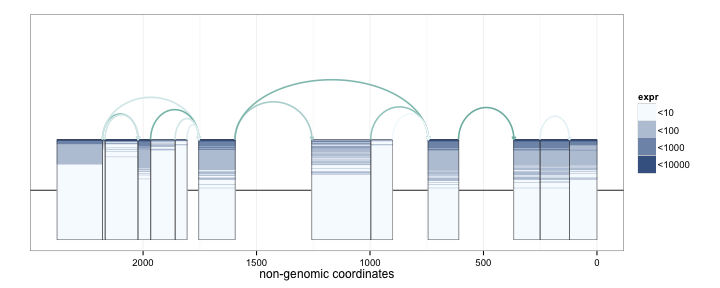

spliceclust
=======================

## Contents
1. [Introduction](#intro)
2. [Plotting Examples](#plotting)


## <a name="intro"></a> Introduction
___Note that this document is still under construction.___  

This package may be used to plot expression across exons and splice junctions
across a large cohort of samples.


## <a name="plotting"></a> Plotting Examples

First we must construct a `concomp` object.


```r
klk12_gl <- split(klk12_gr1, mcols(klk12_gr1)$kind)
klk12_cc <- concomp(klk12_gl)
```

We first demonstrate the default and basic SpliceGraHM (Splice Graph Heat Map) plotting procedure.


```r
splicegrahm(klk12_cc)
```

 

In the plot above, each box arranged horizontally corresponds to a contiguous exonic region
along the genome. 


```r
splicegrahm(klk12_cc, genomic = FALSE)
```

 


```r
splicegrahm(klk12_cc, genomic = FALSE)
```

 
