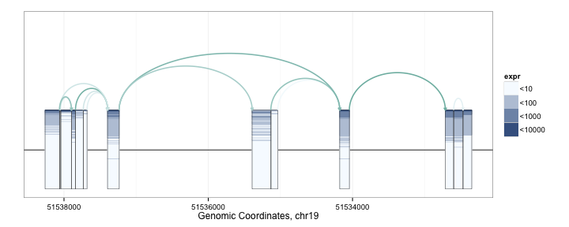
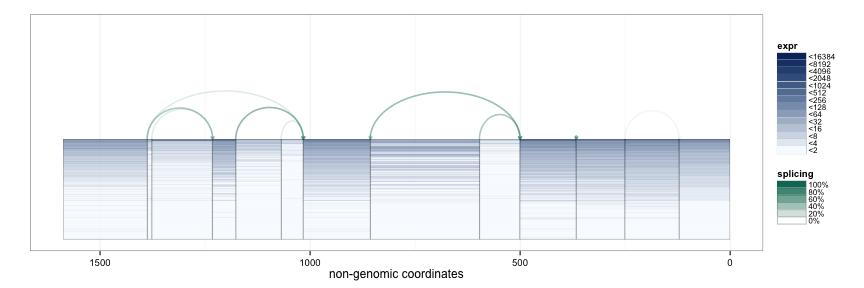
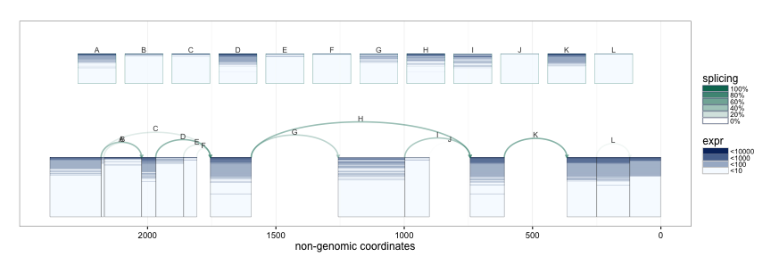
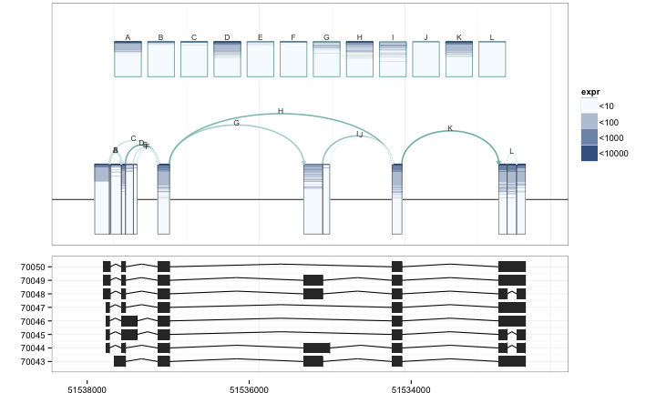
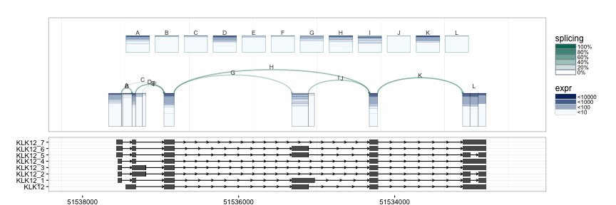
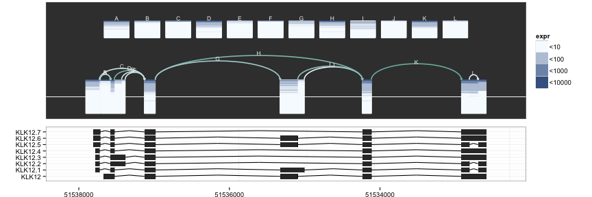
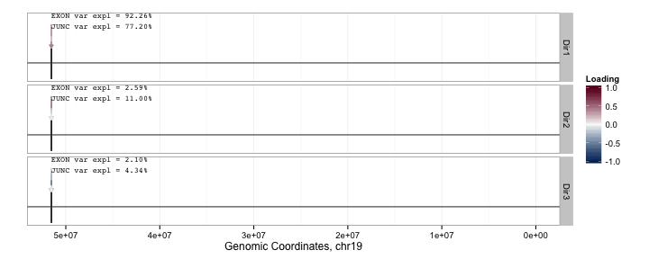
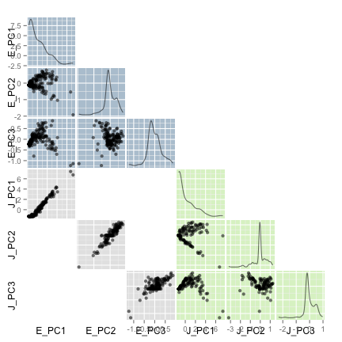
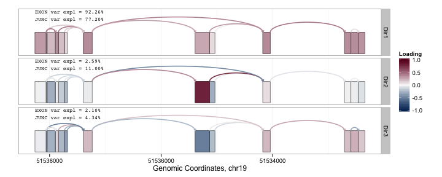
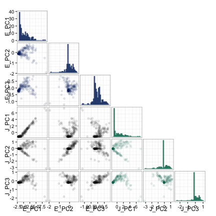

spliceclust [](https://travis-ci.org/pkimes/spliceclust)
=======================

## Contents
1. [Introduction](#intro)
2. [SpliceGraHM Examples](#splicegrahm)
3. [SplicePCA Examples](#splicepca)
4. [SplicePCP Examples](#splicepcp)


## <a name="intro"></a> Introduction
___Note that this document is still under construction.___  

This package may be used to plot exon and splice junction coverage across a large cohort
of RNA-seq samples. The plotting approach is based on the idea of transposing
expression heatmaps on splicing diagrams. The plots are generated using the `ggplot2` and
`ggbio` packages.


## <a name="splicegrahm"></a> SpliceGraHM Examples

First we must construct a `concomp` object from a `GRangesList` object with exon and junction
boundaries and corresponding coverage values. For illustration purposes, we use a previously
constructed `GRanges` object, `klk12_gr1`, containing annotation information for the KLK12 gene
locus along with coverage for 177 lung squamous cell carcinoma samples.  

The exon and junction boundaries, and the corresponding kind label are given by:  


```r
ranges(klk12_gr1)
```

```
## IRanges of length 25
##         start      end width names
## [1]  51532348 51532468   121 33127
## [2]  51532468 51532598   131 33128
## [3]  51532469 51532597   129 33129
## [4]  51532598 51532713   116 33130
## [5]  51532713 51534044  1332 33131
## ...       ...      ...   ...   ...
## [21] 51537896 51538051   156 33147
## [22] 51537896 51538062   167 33148
## [23] 51537897 51538040   144 33149
## [24] 51538051 51538061    11 33150
## [25] 51538062 51538261   200 33151
```

```r
mcols(klk12_gr1)$kind
```

```
##  [1] "e" "j" "e" "e" "j" "e" "j" "j" "j" "e" "e" "j" "e" "j" "j" "j" "j"
## [18] "e" "e" "e" "j" "j" "e" "e" "e"
```

In addition to `kind`, the `klk12_gr1` metadata columns also include the gene name (`gIdx`),
gene boundaries (`gStart`, `gStop`), and coverage values for the 177 samples.  


```r
mcols(klk12_gr1)[1:5, 1:6]
```

```
## DataFrame with 5 rows and 6 columns
##          gIdx    gStart     gStop        kind        s1        s2
##   <character> <numeric> <numeric> <character> <numeric> <numeric>
## 1    gene9317  51532348  51538261           e   2.60331   5.32231
## 2    gene9317  51532348  51538261           j   0.00000   0.00000
## 3    gene9317  51532348  51538261           e   2.59690  10.37210
## 4    gene9317  51532348  51538261           e   2.15517   7.28448
## 5    gene9317  51532348  51538261           j   0.00000   7.00000
```

To construct the `concomp` (connected component) object for analysis, we first convert the
`GRanges` object into a `GRangesList` object of length 2, corresponding to exon and junction
information.  


```r
klk12_gl <- split(klk12_gr1, mcols(klk12_gr1)$kind)
klk12_cc <- concomp(klk12_gl)
```


We first demonstrate the default and __basic SpliceGraHM__ (Splice Graph Heat Map) plotting procedure.


```r
splicegrahm(klk12_cc)
```

 

In the plot above, each box arranged horizontally corresponds to a contiguous exonic region
along the genome. Each box is colored by 177 horizontal lines, showing the expression level
for the 177 samples being analyzed. Note that the exons are plotted along genomic coordinates, and
log expression is shown in color.  

In addition to the boxes, the plot contains arrows which correspond to a splicing events with
sufficient support in the data (e.g. at least 8 samples, each with at least 5 reads spanning the splice
junction). The arrows are colored such that darker arrows were present in a higher proportion of the
177 samples (scale shown on right).  

The SpliceGraHM name is in reference to the fact that after removing the spacing between each exon
the plot simply reduces to a __standard heatmap__ of expression along a single gene. The corresponding
figure after removing the intronic gaps is shown below. The rectangle of color is a heatmap with rows
and columns corresponding to samples and exons, respectively.  


```r
splicegrahm(klk12_cc, genomic = FALSE, ex_use = 1, log_base = 2)
```

 

It is possible to show the coverage of each splice junction using a similar convention with rows
corresponding to samples, and with color being used for coverage.


```r
splicegrahm(klk12_cc, genomic = FALSE, j_incl = TRUE)
```

 

If annotation information is available, e.g. from UCSC KnownGenes, these can be passed to the
function to add an additional track to the plot. The appropriate `GRangesList` object to be
passed is illustrated in the following example.


```r
suppressPackageStartupMessages(library("TxDb.Hsapiens.UCSC.hg19.knownGene"))
txdb <- TxDb.Hsapiens.UCSC.hg19.knownGene
isActiveSeq(txdb)[seqlevels(txdb)] <- FALSE
isActiveSeq(txdb)[paste0("chr", 1:22)] <- TRUE
exbytx <- exonsBy(txdb, "tx")

splicegrahm(klk12_cc, genomic = TRUE, j_incl = TRUE, txlist = exbytx)
```

 

If gene names are desired, the following can be used to match the transcript ID
in `txdb` against gene symbols (e.g. in `org.Hs.eg.db`).


```r
suppressPackageStartupMessages(library("org.Hs.eg.db"))

splicegrahm(klk12_cc, genomic = TRUE, j_incl = TRUE, txlist = exbytx,
            txdb = txdb, orgdb = org.Hs.eg.db)
```

 

The `splicegrahm` function can now also plot gene models in non-genomic space
with an additional parameter `eps`. The `eps` parameter determines how far up/down
from the connected component to lookfor overlapping gene models. If `eps = NULL`,
all overlapping gene models are included. If `eps = 1000`, only overlapping gene
models which are fully contained within 1000bp of the connected component
are included.


```r
splicegrahm(klk12_cc, genomic = FALSE, j_incl = TRUE, txlist = exbytx,
            txdb = txdb, orgdb = org.Hs.eg.db, eps = NULL)
```

 


```r
splicegrahm(klk12_cc, genomic = FALSE, j_incl = TRUE, txlist = exbytx,
            txdb = txdb, orgdb = org.Hs.eg.db, eps = 0)
```

 


```r
splicegrahm(klk12_cc, genomic = FALSE, j_incl = TRUE, txlist = exbytx,
            txdb = txdb, orgdb = org.Hs.eg.db, eps = 1000)
```

 


## <a name="splicepca"></a> SplicePCA Examples

Principal Component Analysis (PCA) is a popular exploratory analysis tool for studying low rank
structure in high-dimensional datasets by projecting the data along the directions of greatest
variation. These directions of greatest variation are often referred to as the PC "loading"
directions. The `splicepca` function is written to visualize the loading vectors of splicing
data.  

As an example, the following code can be used to visualize the first 3 PC loadings in the
KLK12 dataset from above.


```r
splicepca(klk12_cc, npc = 3)
```

 

In the above PC loadings plot, red and blue are used to denote the magnitude of the PC loadings
for each exon and splice junction. From the plot above, we see that the greatest source of variation
in expression at the KLK12 gene locus is the overall expression of the gene. However, the second
PC loading shows interesting behavior where the primary source of variation is attributable to the
expression of the central exon. Scrolling up a little to the UCSC KnownGenes shown included above,
we see that the presence or absence of the central exon actually corresponds to differing isoforms
annotated to this gene. Note that above the PCs are computed separately for exons and junctions
 information. As such, we obtain separate PC "scores" for the exon and junction PC loadings.
 

```r
splicepca(klk12_cc, npc = 3, scores = TRUE)
```

 

It is also possible to perform the PCA analysis using the concatenated exon and junction information by
setting the `pc_sep` parameter to `FALSE`, and specifying the relative "weight" of each with `ej_w`. The
exon and junction data are rescaled to each have sum-of-squares equal to the values specified by `ej_w`.
In the following example, we use equal weights for the two data sources.


```r
splicepca(klk12_cc, npc = 3, pc_sep = FALSE, ej_w = c(1, 1))
```

 


## <a name="splicepcp"></a> SplicePCP Examples

All above plots have used color to represent expression value. However, low frequency or outlier events may
become lost in this particular view. To handle this problem, we also provide the option to plot the
splicing objects with vertical height (the y-axis) corresponding to expression. The name of the function is
a reference to [_parallel coordinates plots_](pcp). The same _KLK12_ data is shown below using the
`splicepcp` function.


```r
splicepcp(klk12_cc, genomic = TRUE, txlist = exbytx, txdb = txdb, orgdb = org.Hs.eg.db)
```

 

The plot includes 3 tracks:
  1. log-expression values for each exon or region of an exon
  2. the complete gene model and splice junctions
  3. annotated transcripts from the UCSC KnownGene database.

Currently, the function is being rewritten to also include junction coverage using a
parallel coordinates plot in a separate track.


## <a name="sessioninfo"></a> Session Information


```r
sessionInfo()
```

```
## R version 3.1.1 (2014-07-10)
## Platform: x86_64-apple-darwin13.3.0 (64-bit)
## 
## locale:
## [1] en_US.UTF-8/en_US.UTF-8/en_US.UTF-8/C/en_US.UTF-8/en_US.UTF-8
## 
## attached base packages:
## [1] stats4    parallel  stats     graphics  grDevices utils     datasets 
## [8] methods   base     
## 
## other attached packages:
##  [1] org.Hs.eg.db_3.0.0                     
##  [2] RSQLite_1.0.0                          
##  [3] DBI_0.3.1                              
##  [4] TxDb.Hsapiens.UCSC.hg19.knownGene_3.0.0
##  [5] GenomicFeatures_1.18.3                 
##  [6] spliceclust_0.1.1                      
##  [7] BSgenome.Hsapiens.UCSC.hg19_1.4.0      
##  [8] BSgenome_1.34.1                        
##  [9] rtracklayer_1.26.2                     
## [10] Biostrings_2.34.1                      
## [11] XVector_0.6.0                          
## [12] GGally_0.5.0                           
## [13] annotate_1.44.0                        
## [14] XML_3.98-1.1                           
## [15] AnnotationDbi_1.28.1                   
## [16] Biobase_2.26.0                         
## [17] GenomicRanges_1.18.4                   
## [18] GenomeInfoDb_1.2.4                     
## [19] IRanges_2.0.1                          
## [20] S4Vectors_0.4.0                        
## [21] RColorBrewer_1.1-2                     
## [22] ggbio_1.14.0                           
## [23] BiocGenerics_0.12.1                    
## [24] ggplot2_1.0.0                          
## 
## loaded via a namespace (and not attached):
##  [1] acepack_1.3-3.3          base64enc_0.1-2         
##  [3] BatchJobs_1.5            BBmisc_1.8              
##  [5] BiocParallel_1.0.0       biomaRt_2.22.0          
##  [7] biovizBase_1.14.1        bitops_1.0-6            
##  [9] brew_1.0-6               checkmate_1.5.1         
## [11] cluster_1.15.3           codetools_0.2-9         
## [13] colorspace_1.2-4         compiler_3.1.1          
## [15] devtools_1.6.1           dichromat_2.0-0         
## [17] digest_0.6.8             evaluate_0.5.5          
## [19] fail_1.2                 foreach_1.4.2           
## [21] foreign_0.8-62           formatR_1.0             
## [23] Formula_1.1-2            GenomicAlignments_1.2.1 
## [25] graph_1.44.1             grid_3.1.1              
## [27] gridExtra_0.9.1          gtable_0.1.2            
## [29] Hmisc_3.14-6             iterators_1.0.7         
## [31] knitr_1.8                labeling_0.3            
## [33] lattice_0.20-29          latticeExtra_0.6-26     
## [35] MASS_7.3-35              munsell_0.4.2           
## [37] nnet_7.3-8               OrganismDbi_1.8.0       
## [39] plyr_1.8.1               proto_0.3-10            
## [41] RBGL_1.42.0              Rcpp_0.11.3             
## [43] RCurl_1.95-4.5           reshape_0.8.5           
## [45] reshape2_1.4.1           rpart_4.1-8             
## [47] Rsamtools_1.18.2         scales_0.2.4            
## [49] sendmailR_1.2-1          splines_3.1.1           
## [51] stringr_0.6.2            survival_2.37-7         
## [53] tools_3.1.1              VariantAnnotation_1.12.8
## [55] xtable_1.7-4             zlibbioc_1.12.0
```


[pcp]: http://en.wikipedia.org/wiki/Parallel_coordinates
