------------------------------------------------------------------------
## Preliminary

load necessary packages


```r
library("ggplot2")
library("ggbio")
library("RColorBrewer")
library("GenomicRanges")
library("SplicingGraphs")
library("annotate")
library("BSgenome.Hsapiens.UCSC.hg19")
library("TxDb.Hsapiens.UCSC.hg19.knownGene")
library("org.Hs.eg.db")
library("PTAk")
library("igraph")
library("mvnmle")

## set nicer colors
brew_set1 <- brewer.pal(9, "Set1")
brew_pastel2 <- brewer.pal(8, "Pastel2")
brew_accent <- brewer.pal(8, "Accent")
brew_greys <- brewer.pal(9, "Greys")


## specify project directory and source functions
root <-"/Users/pkimes/Dropbox/Git/spliceclust/"
source(paste0(root, "R/readchr.R"))
```

load chromesome 7 data for 177 lusc samples


```r
## complete datasest
chr6 <- readchr(paste0(root, "data/lusc/chr6_gene.txt"), 177)
## exon only dataset
chr6_e <- subset(chr6, kind == "e")
```

------------------------------------------------------------------------
## general chr6

count up number of exons


```r
exon_cnts <- table(chr6_e$gIdx)
summary(as.numeric(exon_cnts))
##    Min. 1st Qu.  Median    Mean 3rd Qu.    Max. 
##     1.0     1.0     1.0     1.7     1.0   273.0
```

plot distribution of exon counts

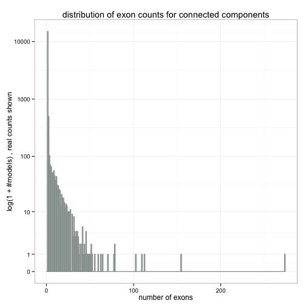 

------------------------------------------------------------------------
## single exon genes

subset on only single gene models


```r
e1_gIdx <- names(which(exon_cnts == 1))
e1set <- subset(chr6_e, gIdx %in% e1_gIdx)
e1set$chr <- "chr6"
```

convert to `GRanges` object to use with `ggbio`


```r
e1set_gr <- makeGRangesFromDataFrame(e1set,
                                     seqnames.field="chr",
                                     keep.extra.columns=TRUE)
seqlengths(e1set_gr) <- seqlengths(BSgenome.Hsapiens.UCSC.hg19)["chr6"]
```

plot location of single exon genes on chromosome


```
## [1] TRUE
## Scale for 'x' is already present. Adding another scale for 'x', which will replace the existing scale.
## Scale for 'x' is already present. Adding another scale for 'x', which will replace the existing scale.
## Scale for 'x' is already present. Adding another scale for 'x', which will replace the existing scale.
```

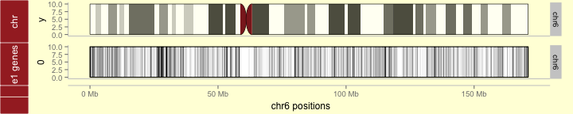 

compute the average expression

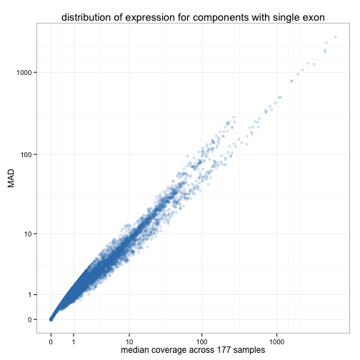 

compute distribution of  exon length


```
## stat_bin: binwidth defaulted to range/30. Use 'binwidth = x' to adjust this.
```

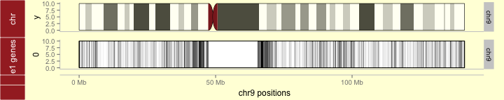 

load transcript annotations and only look at chr6


```r
txdb <- TxDb.Hsapiens.UCSC.hg19.knownGene
isActiveSeq(txdb)[seqlevels(txdb)] <- FALSE
isActiveSeq(txdb)["chr6"] <- TRUE

##want to work at exon level aggregated by genes or transcripts
exbygene <- exonsBy(txdb, "gene")
exbytx <- exonsBy(txdb, "tx")
```

Calculate overlap with genes and transcripts


```r
## overlap with genes
hits_g <- findOverlaps(exbygene, e1set_gr)
ucsc_ovlp_g <- select(org.Hs.eg.db, keys=names(exbygene[queryHits(hits_g)]),
                      columns="SYMBOL", keytype="ENTREZID")

## overlap with transcripts
hits_tx <- findOverlaps(exbytx, e1set_gr)
ucsc_ovlp_tx <- select(txdb, keys=names(exbytx[queryHits(hits_tx)]),
                       columns=c("GENEID", "TXNAME"), keytype="TXID")
ucsc_ovlp_tx$idx <- 1:nrow(ucsc_ovlp_tx)
temp <- select(org.Hs.eg.db, keys=unique(ucsc_ovlp_tx$GENEID),
               columns="SYMBOL", keytype="ENTREZID")
## Warning: 'NA' keys have been removed
names(temp) <- c("GENEID", "SYMBOL")
ucsc_ovlp_tx <- merge(ucsc_ovlp_tx, temp, all.x=TRUE, sort=FALSE)
ucsc_ovlp_tx <- ucsc_ovlp_tx[order(ucsc_ovlp_tx$idx), ]

## 1. add distance to closest named genes
## 2. look at named genes for highest expression 1e genes
```

There were 371 unique UCSC genes that overlapped with
1006 unique connected components. Total number of
overlaps was 1020.


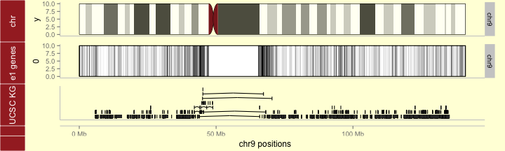 

Similar plot as above, but at the scale of transcripts.


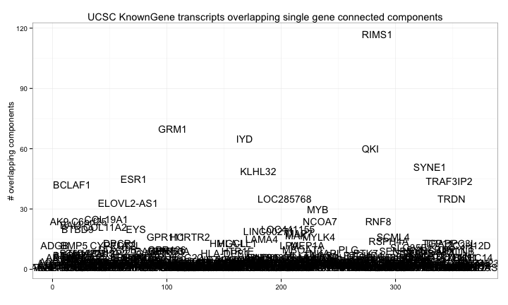 

We now add UCSC KnownGenes to above `tracks` plots. Note that these are not
real transcripts, just the 'union' transcripts for each gene constructed by
joining all reported isoforms. (note: need to specify `fixed() <- TRUE` for
ucsc track since plot includes ideogram.)

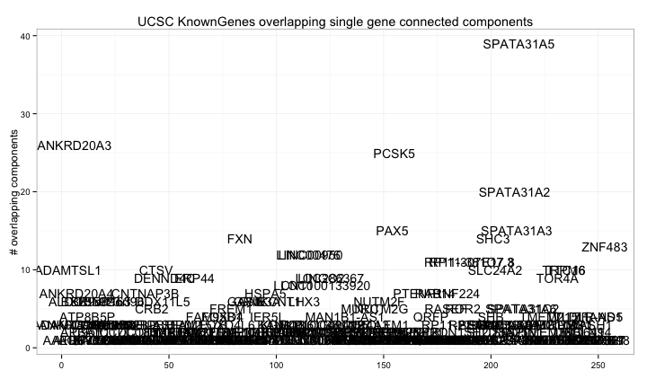 

Next, we focus on COL19A1  which
overlapped with 21 single exon connected components.


```r
top1 <- ovlp_table_g$Var1[which.max(ovlp_table_g$Freq)]
top1_tx <- subset(ucsc_ovlp_tx, ucsc_ovlp_tx$SYMBOL == top1)
table(top1_tx$TXNAME)
## 
## uc003pfc.1 uc010kam.2 
##         21          4

top1_txname <- names(which.max(table(top1_tx$TXNAME)))
top1_hits <- subset(hits_tx, ucsc_ovlp_tx$TXNAME == top1_txname)

gg_chr6zoom <- autoplot(exbytx[queryHits(top1_hits)])
fixed(gg_chr6zoom) <- FALSE

gg_e1zoom <- autoplot(e1set_gr[subjectHits(top1_hits)], alpha=1/5)
fixed(gg_e1zoom) <- FALSE

tracks("UCSC KG" = gg_chr6zoom,
       "e1 genes" = gg_e1zoom,
       heights=c(1/3, 1/3), xlab="chr6 positions") +
    theme_tracks_sunset()
```

 

------------------------------------------------------------------------
## two exon genes

We can look at the number of exons in each connected component (same
as shown above)


```r
head(table(exon_cnts))
## exon_cnts
##     1     2     3     4     5     6 
## 15056   499   103    70    65    51
```

We can also look at the number of exons and junctions in each connected
component. Note, ideally, no 2 e/j objects should exist.


```r
ej_cnts <- table(chr6$gIdx)
head(table(ej_cnts))
## ej_cnts
##     1     2     3     4     5     6 
## 15056   349   168    11    73    14
```

looking at some genes which have 2 "exons" but no splicing


```r
names(ej_cnts[ej_cnts == 2])[1:10]
##  [1] "gene10040" "gene10055" "gene10080" "gene10094" "gene101"  
##  [6] "gene10104" "gene10131" "gene10139" "gene10156" "gene1018"
chr6[chr6$gIdx == names(ej_cnts[ej_cnts == 2])[1], 1:6]
##            gIdx    gStart     gStop kind     start      stop
## 25809 gene10040 100581747 100581922    e 100581747 100581800
## 25810 gene10040 100581747 100581922    e 100581801 100581922
```

------------------------------------------------------------------------
## genes with greater than one exon

also construct subset with more than a single exon


```r
e2pset <- subset(chr6_e, !(gIdx %in% e1_gIdx))
e2pset$chr <- "chr6"
```

as with single exon genes, we construct a `GRangesList` object to use with `ggbio`


```r
e2pset_gr <- makeGRangesFromDataFrame(e2pset,
                                      seqnames.field="chr",
                                      keep.extra.columns=TRUE)
seqlengths(e2pset_gr) <- seqlengths(BSgenome.Hsapiens.UCSC.hg19)["chr6"]
```

compute distribution of average expression over each exon and plot distributions
grouped by the number of exons each gene

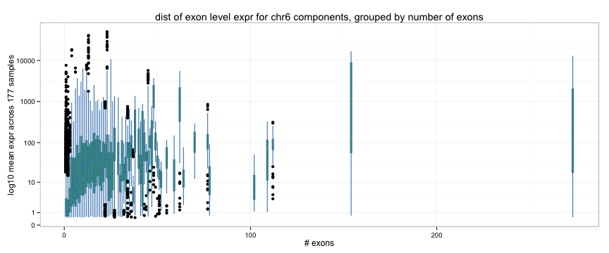 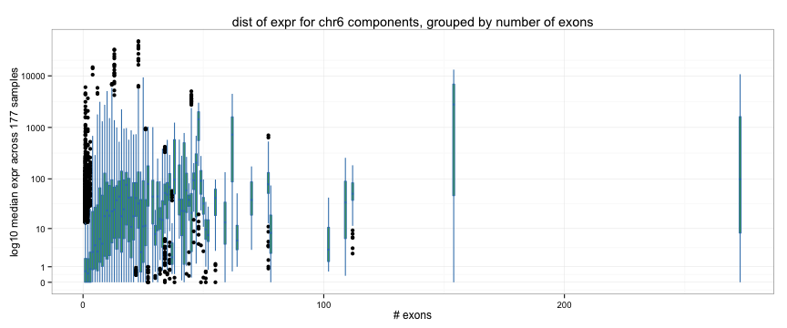 

------------------------------------------------------------------------
## HLA-DRB1 region

ucsc browser for chr6:32,103,867-33,000,293
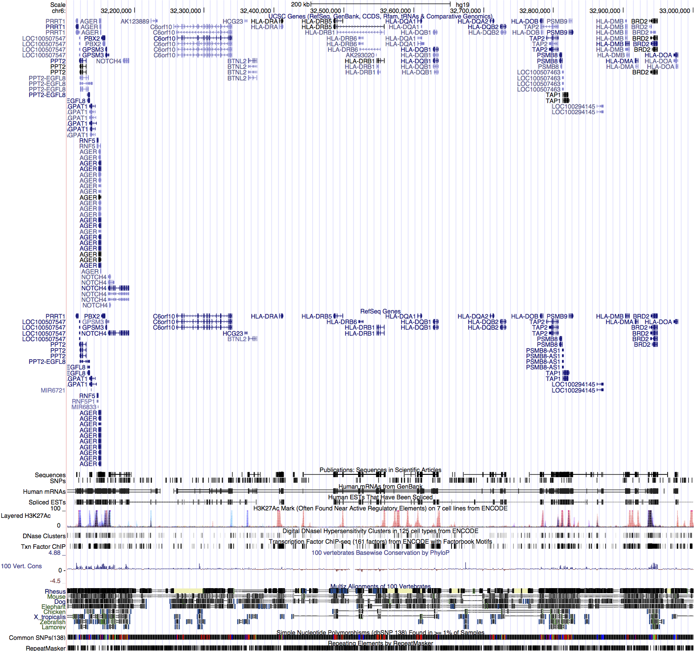  

look in region around HLA-DRB1 (on rev strand)


```r
hladrb1_eid <- select(org.Hs.eg.db, keys="HLA-DRB1",
                  columns="ENTREZID", keytype="SYMBOL")
hladrb1_txid <- select(txdb, keys=hladrb1_eid$ENTREZID,
                   columns=c("TXID", "TXNAME"), keytype="GENEID")
## Warning: 'select' resulted in 1:many mapping between keys and return rows

hladrb1_tx <- exbytx[as.character(hladrb1_txid$TXID)]
hladrb1_uniontx <- reduce(unlist(hladrb1_tx))
bounds <- c(start(range(hladrb1_uniontx)), end(range(hladrb1_uniontx)))

cands1 <- (chr6_e$start > 32400000) &
          (chr6_e$stop < 32700000)
cand_g <- chr6_e$gIdx[cands1]

hladrb1_set <- subset(chr6_e, gIdx %in% unique(cand_g))
hladrb1_set$chr <- "chr6"
```

convert to `GRanges` object to use with `ggbio`


```r
hladrb1_gr <- makeGRangesFromDataFrame(hladrb1_set,
                                   seqnames.field="chr",
                                   keep.extra.columns=TRUE)
seqlengths(hladrb1_gr) <- seqlengths(BSgenome.Hsapiens.UCSC.hg19)["chr6"]
```

convert to `GRangesList` object to separate out groups of genes


```r
hladrb1_gl <- split(hladrb1_gr, mcols(hladrb1_gr)$gIdx)
```

plot


```r
gg_hladrb1models <- autoplot(hladrb1_tx)
fixed(gg_hladrb1models) <- FALSE

gg_hladrb1_cc <- autoplot(hladrb1_gl)
fixed(gg_hladrb1_cc) <- FALSE

tracks("UCSC" = gg_hladrb1models,
       "concomp" = gg_hladrb1_cc,
       heights=c(1/3, 1/3), xlab="chr6 positions") +
    theme_tracks_sunset()
```

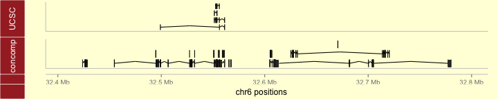 

go back and look at the longest one


```r
gg_hladrb1top <- autoplot(hladrb1_gl["gene4233"])

hladrbX_eid <- select(org.Hs.eg.db,
                      keys=c("HLA-DRB1", "HLA-DRB5", "HLA-DRB6"),
                  columns="ENTREZID", keytype="SYMBOL")
hladrbX_txid <- select(txdb, keys=hladrbX_eid$ENTREZID,
                   columns=c("TXID", "TXNAME"), keytype="GENEID")
## Warning: 'select' resulted in 1:many mapping between keys and return rows
hladrbX_tx <- exbytx[as.character(hladrbX_txid$TXID)]

gg_hladrbXmodels <- autoplot(hladrbX_tx)
fixed(gg_hladrbXmodels) <- FALSE
tracks("hla-drb1" = gg_hladrb1models,
       "hla-drb1/5/6" = gg_hladrbXmodels,
       "concomp" = gg_hladrb1top,
       heights=c(3/8, 3/8, 1/4), xlab="chr6 positions") +
    theme_tracks_sunset()
```

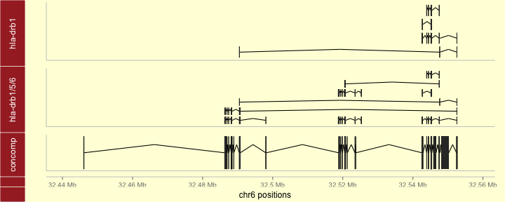 

------------------------------------------------------------------------
### Plotting expression and splicing at HLA-DRB1 locus

From above, most likely connected component was `gene4233`


```r
hladrb1_ej <- subset(chr6, gIdx == "gene4233")
hladrb1_ej$chr <- "chr6"

hladrb1_gr1 <- makeGRangesFromDataFrame(hladrb1_ej,
                                    seqnames.field="chr",
                                    keep.extra.columns=TRUE)
seqlengths(hladrb1_gr1) <- seqlengths(BSgenome.Hsapiens.UCSC.hg19)["chr6"]
strand(hladrb1_gr1) <- "-"

hladrb1_gl1 <- split(hladrb1_gr1, mcols(hladrb1_gr1)$kind)
```

one approach to plotting expression with equal widths given to each
'exon'.


```r

hladrb1_gl1j <- hladrb1_gl1$j
aa <- as.data.frame(findOverlaps(hladrb1_gl1j, hladrb1_gl1j, type="within"))

aa2 <- aggregate(aa$queryHits, list(aa$subjectHits), c)
aa2$len <- sapply(aa2$x, length)

aa2$h <- 0
for (i in sort(unique(aa2$len)))
    aa2$h[which(aa2$len == i)] <- sapply(aa2$x[which(aa2$len == i)],
              function(z) max(unlist(aa2$h[z]))+.3)

aa2$h2 <- aa2$h * (-1)^(1+aa2$h/.3)

mcols(hladrb1_gl1j)$offset <- aa2$h
mcols(hladrb1_gl1j)$offset2 <- 0.3*aa2$len
mcols(hladrb1_gl1j)$offset3 <- aa2$h2

bb <-
    ggplot(hladrb1_gl1$e) +
    geom_rect(fill="grey", color="grey30", size=.3) +
    geom_chevron(hladrb1_gl1j, color="grey30", offset="offset3",
                 stat="identity", size=.5, alpha=1/2, aes(y=I(1.4))) +
    theme_alignment() +
    scale_x_continuous(breaks=1e4*
                           seq(floor(start(range(hladrb1_gl1$e))/1e4),
                               ceiling(end(range(hladrb1_gl1$e))/1e4)))
## Scale for 'y' is already present. Adding another scale for 'y', which will replace the existing scale.

hladrb1_te <- as.data.frame(mcols(hladrb1_gl1$e)[paste0("s", 1:177)])
hladrb1_te$eid <- 1:nrow(hladrb1_te)
hladrb1_te <- reshape2::melt(hladrb1_te, id.var="eid")
hladrb1_te$value <- log10(1+hladrb1_te$value)

ggplot(hladrb1_te, aes(xmin=eid-.4, xmax=eid+.4,
                   ymin=value, ymax=value+.05, group=variable)) +
    geom_rect(color="grey60", fill="grey30", alpha=1/5) + guides(color=FALSE) +
    geom_line(aes(x=eid, y=value), alpha=1/5) +
    theme_bw() +
    xlab("exon") + ylab("log10 expr")
```

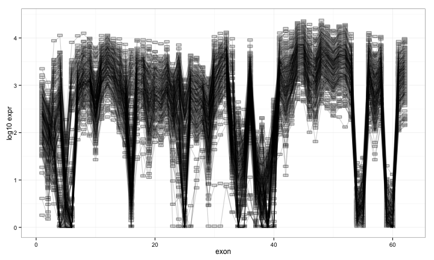 

adding annotations


```r
plotRangesLinkedToData(hladrb1_gl1$e, stat.y=paste0("s", 1:177),
                       linetype=0, annotation=bb)
## Scale for 'y' is already present. Adding another scale for 'y', which will replace the existing scale.
```

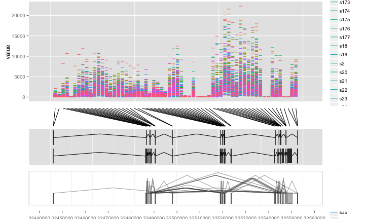 

Alternative approach to plotting with no re-scaling.
Using genomic coordinates.


```r
hladrb1_exp <- reshape2::melt(subset(hladrb1_ej, kind=="e"),
                          id.vars=c("gIdx", "gStart", "gStop", "kind",
                              "start", "stop", "chr"))
hladrb1_exp$log1p <- log10(hladrb1_exp$value+1)

gg_logexp <-
    ggplot(hladrb1_exp,
           aes(xmin=start, xmax=stop,
               ymin=log1p, ymax=log1p+.05)) +
    geom_rect(fill="white", color="grey30", alpha=1/5) +
    geom_line(aes(x=(start+stop)/2, y=log1p, group=variable), alpha=1/10) +
    theme_bw()


tracks(gg_logexp,
       autoplot(GRangesList(hladrb1_gl1$e), gap.geom="arrow",
                fill="grey80", color="grey30") + theme_bw(),
       "UCSC" = gg_hladrbXmodels,
       "ccmodel" = gg_hladrb1top,
       heights=c(3, 1, 1, 1))
```

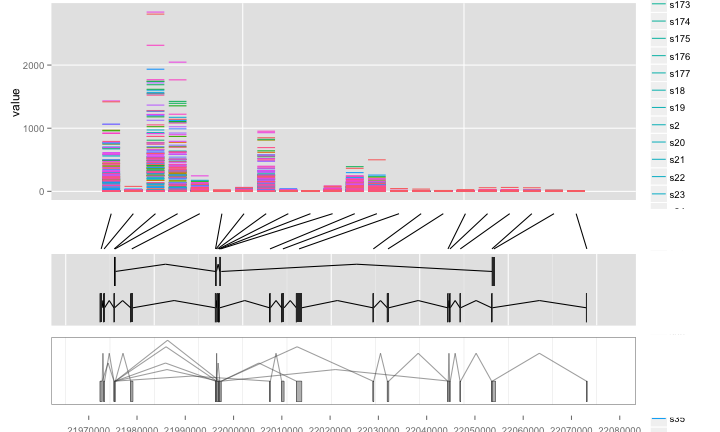 

looking at clustering along the exons at hladrb1


```r
matplot(log10(1+hladrb1_ej[hladrb1_ej$kind == "e", -c(1:6, 184)]), type="l", lty=1)
```

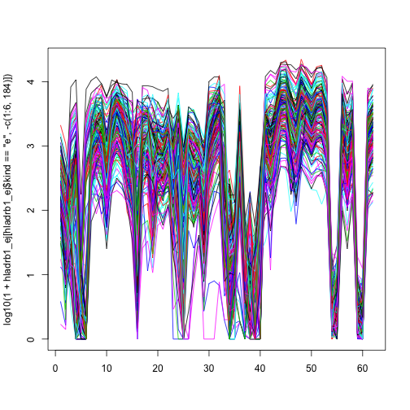 

PCA decomposition (exon and splicing separately)


```r
pc <- prcomp(log10(1+t(hladrb1_ej[hladrb1_ej$kind == "e", -c(1:6, 184)])))
pc_j <- prcomp(log10(1+t(hladrb1_ej[hladrb1_ej$kind == "j", -c(1:6, 184)])))
```

exon PCA decomposition (scores)


```r
plot(pc$x[, 1:2], pch=16, col=brew_set1[2])
```

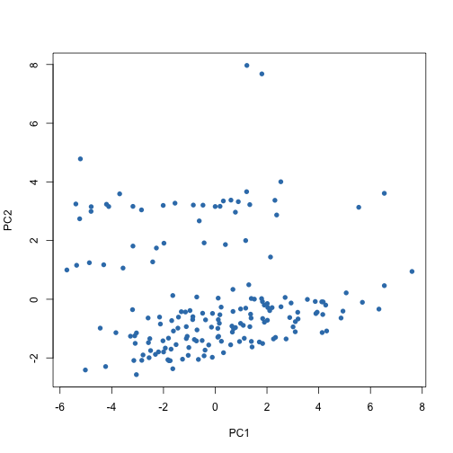 

exon PCA decomposition (loadings)


```r
qplot(data=reshape2::melt(pc$rotation[, 1:2]), x=rep(1:22, 2), y=value, color=Var2,
      geom="line") +
    theme_bw() +
    scale_x_continuous(breaks=1:22)
## Error: Aesthetics must either be length one, or the same length as the
## dataProblems:rep(1:22, 2)
```

splice junction PCA decomposition (scores)


```r
plot(pc_j$x[, 1:2], pch=16, col=brew_set1[2],
     main="PCA scores for splicing junctions")
```

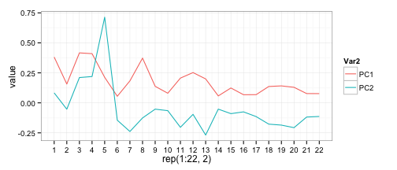 

------------------------------------------------------------------------
### Process hladrb1 locus for graph-based analysis


```r
hladrb1_v <- hladrb1_ej[hladrb1_ej$kind == "e", c("start", "stop")]
hladrb1_e <- hladrb1_ej[hladrb1_ej$kind == "j", c("start", "stop")]

## determine explicit edgeset
hladrb1_e$a <- sapply(hladrb1_e$start, function(x) which(hladrb1_v$stop == x))
hladrb1_e$b <- sapply(hladrb1_e$stop, function(x) which(hladrb1_v$start == x))
hladrb1_el1 <- as.matrix(hladrb1_e[c("a", "b")])

## determine 'edges' that exist between consecutive exons
conseq <- which((hladrb1_v$start[-1] - hladrb1_v$stop[-22]) == 1)
hladrb1_el2 <- cbind("a"=conseq, "b"=conseq+1)
```

------------------------------------------------------------------------
### Plot splicing graph for Sample 2


```r
hladrb1_vw2 <- hladrb1_ej[hladrb1_ej$kind == "e", "s2"]
hladrb1_ew2 <- hladrb1_ej[hladrb1_ej$kind == "j", "s2"]

hladrb1_adj2 <- matrix(0, nrow(hladrb1_v), nrow(hladrb1_v))
diag(hladrb1_adj2) <- hladrb1_vw2
hladrb1_adj2[hladrb1_el1] <- hladrb1_ew2
hladrb1_adj2[hladrb1_el2] <- apply(matrix(diag(hladrb1_adj2)[hladrb1_el2], ncol=2), 1, min)

g2 <- graph.adjacency(hladrb1_adj2, weighted=TRUE, diag=FALSE)

edge_h <- 1/apply(get.edgelist(g2), 1, diff)
edge_h[edge_h == 1] <- 1e-10
```

example of an adjacency matrix


```r
get.adjacency(graph.adjacency(hladrb1_adj2))[1:10, 1:10]
## 10 x 10 sparse Matrix of class "dgCMatrix"
##                                             
##  [1,] 77 23   .   .  .   .   .    .    .   .
##  [2,]  . 23   .   .  .   .   .    .    .   .
##  [3,]  .  . 427 427  .   .   .    .    .   .
##  [4,]  .  .   . 704 14 252   .    .    .   .
##  [5,]  .  .   .   . 14   .   .    .    .   .
##  [6,]  .  .   .   .  . 361 317    .    .   .
##  [7,]  .  .   .   .  .   . 896  867    .   .
##  [8,]  .  .   .   .  .   .   . 1363 1162   .
##  [9,]  .  .   .   .  .   .   .    . 1162 777
## [10,]  .  .   .   .  .   .   .    .    . 777
```

nicer first draft of a splicing graph


```r
plot(g2, layout=cbind(1:22, 0),
     edge.curved=7*edge_h,
     edge.arrow.size=.3,
     edge.width=log2(E(g2)$weight+1),
     vertex.shape="rectangle", vertex.label=NA,
     vertex.size=4.5, vertex.size2=2)
## Error: non-numeric argument to binary operator
```

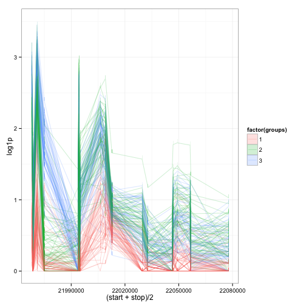 

------------------------------------------------------------------------
### Analyze 3-dimensional tensor of adjacency matrices

#### construct adjacency tensor


```r
adj_array <- array(0, dim=c(177, nrow(hladrb1_v), nrow(hladrb1_v)))
for (i in 1:177) {
    diag(adj_array[i, , ]) <- hladrb1_ej[hladrb1_ej$kind == "e", paste0("s", i)]
    adj_array[cbind(i, hladrb1_el1)] <- hladrb1_ej[hladrb1_ej$kind == "j", paste0("s", i)]
    adj_array[cbind(i, hladrb1_el2)] <-
        apply(matrix(diag(adj_array[i, , ])[hladrb1_el2], ncol=2), 1, min)
}
```

#### Tucker PCA decomposition


```r
tucker_pca <- PCAn(log10(1+adj_array), dim=c(3, 3, 3))
## -----Execution Time----- 0.293
tucker_scores <- as.data.frame(t(tucker_pca[[1]]$v[1:2, ]))
```

Tucker decomposition (scores)


```r
qplot(data=tucker_scores,
      x=V1, y=V2) +
    theme_bw()
```

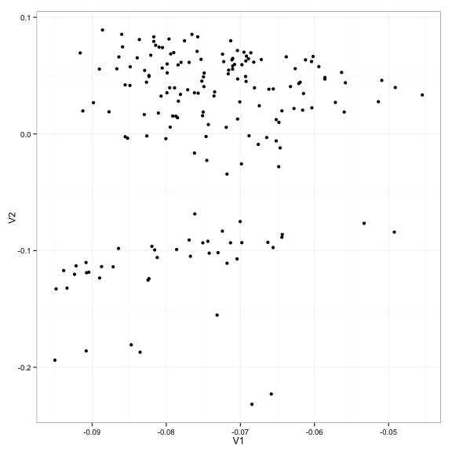 

#### PARAFAC decomposition


```r
parafac_pca <- CANDPARA(log10(1+adj_array), dim=3)
## -----Execution Time----- 1.196
parafac_scores <- as.data.frame(t(parafac_pca[[1]]$v[1:2, ] * parafac_pca[[3]]$d[1:2]))
```

PARAFAC decomposition (scores)


```r
qplot(data=parafac_scores,
      x=V1, y=V2) +
    theme_bw()
```

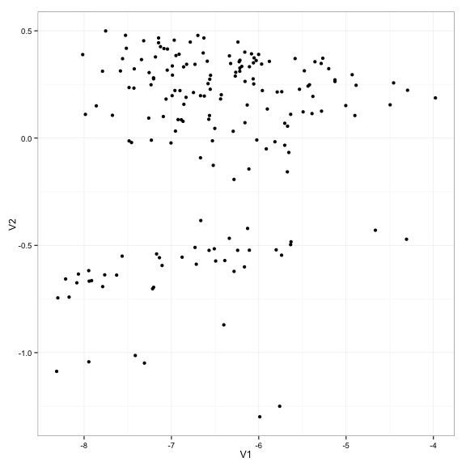 

#### PARAFAC decomposition without splices


```r
adj_array_diag <- array(0, dim=c(177, nrow(hladrb1_v), nrow(hladrb1_v)))
for (i in 1:177) {
    diag(adj_array_diag[i, , ]) <- diag(adj_array[i, , ])
}
parafac_pca_diag <- CANDPARA(log10(1+adj_array_diag), dim=3)
## -----Execution Time----- 1.161
parafac_scores_diag <- as.data.frame(t(parafac_pca_diag[[1]]$v[1:2, ] *
                                           parafac_pca_diag[[3]]$d[1:2]))
```

PARAFAC decomposition with only exons (scores)


```r
qplot(data=parafac_scores_diag,
      x=V1, y=V2) +
    theme_bw()
```

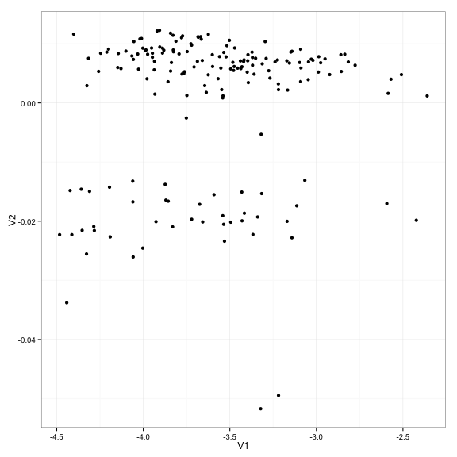 

#### PARAFAC decomposition without exon expr


```r
adj_array_offdiag <- adj_array
for (i in 1:177) {
    diag(adj_array_offdiag[i, , ]) <- 0
}
parafac_pca_offdiag <- CANDPARA(log10(1+adj_array_offdiag), dim=3)
## -----Execution Time----- 1.121
parafac_scores_offdiag <- as.data.frame(t(parafac_pca_offdiag[[1]]$v[1:2, ] *
                                           parafac_pca_offdiag[[3]]$d[1:2]))
```

PARAFAC decomposition with only splices (scores)


```r
qplot(data=parafac_scores_offdiag,
      x=V1, y=V2) +
    theme_bw()
```

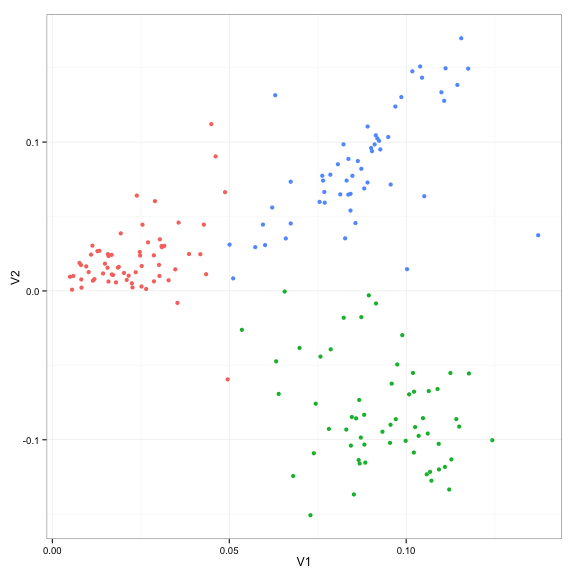 

------------------------------------------------------------------------
### Running Time


```r
proc.time() - start_time
##    user  system elapsed 
##  67.700   3.299  71.035
```

------------------------------------------------------------------------
### Last Updated


```r
Sys.time()
## [1] "2014-09-30 02:09:00 EDT"
```

------------------------------------------------------------------------
### Session Information


```r
sessionInfo()
## R version 3.1.1 (2014-07-10)
## Platform: x86_64-apple-darwin13.3.0 (64-bit)
## 
## locale:
## [1] en_US.UTF-8/en_US.UTF-8/en_US.UTF-8/C/en_US.UTF-8/en_US.UTF-8
## 
## attached base packages:
## [1] grid      parallel  stats     graphics  grDevices utils     datasets 
## [8] methods   base     
## 
## other attached packages:
##  [1] TxDb.Hsapiens.UCSC.hg19.knownGene_2.14.0
##  [2] mvnmle_0.1-11                           
##  [3] igraph_0.7.1                            
##  [4] PTAk_1.2-9                              
##  [5] tensor_1.5                              
##  [6] org.Hs.eg.db_2.14.0                     
##  [7] RSQLite_0.11.4                          
##  [8] DBI_0.3.1                               
##  [9] BSgenome.Hsapiens.UCSC.hg19_1.3.1000    
## [10] annotate_1.42.1                         
## [11] SplicingGraphs_1.4.1                    
## [12] Rgraphviz_2.8.1                         
## [13] graph_1.42.0                            
## [14] GenomicAlignments_1.0.6                 
## [15] BSgenome_1.32.0                         
## [16] Rsamtools_1.16.1                        
## [17] Biostrings_2.32.1                       
## [18] XVector_0.4.0                           
## [19] GenomicFeatures_1.16.2                  
## [20] AnnotationDbi_1.26.0                    
## [21] Biobase_2.24.0                          
## [22] GenomicRanges_1.16.4                    
## [23] GenomeInfoDb_1.0.2                      
## [24] IRanges_1.22.10                         
## [25] RColorBrewer_1.0-5                      
## [26] ggbio_1.12.10                           
## [27] BiocGenerics_0.10.0                     
## [28] ggplot2_1.0.0                           
## [29] BiocInstaller_1.14.2                    
## 
## loaded via a namespace (and not attached):
##  [1] acepack_1.3-3.3          base64enc_0.1-2         
##  [3] BatchJobs_1.4            BBmisc_1.7              
##  [5] BiocParallel_0.6.1       biomaRt_2.20.0          
##  [7] biovizBase_1.12.3        bitops_1.0-6            
##  [9] brew_1.0-6               checkmate_1.4           
## [11] cluster_1.15.3           codetools_0.2-9         
## [13] colorspace_1.2-4         compiler_3.1.1          
## [15] dichromat_2.0-0          digest_0.6.4            
## [17] evaluate_0.5.5           fail_1.2                
## [19] foreach_1.4.2            foreign_0.8-61          
## [21] formatR_1.0              Formula_1.1-2           
## [23] gridExtra_0.9.1          gtable_0.1.2            
## [25] Hmisc_3.14-5             iterators_1.0.7         
## [27] knitr_1.6                labeling_0.3            
## [29] lattice_0.20-29          latticeExtra_0.6-26     
## [31] markdown_0.7.4           MASS_7.3-34             
## [33] Matrix_1.1-4             mime_0.2                
## [35] munsell_0.4.2            nnet_7.3-8              
## [37] plyr_1.8.1               proto_0.3-10            
## [39] Rcpp_0.11.3              RCurl_1.95-4.3          
## [41] reshape2_1.4             rpart_4.1-8             
## [43] rtracklayer_1.24.2       scales_0.2.4            
## [45] sendmailR_1.2-1          splines_3.1.1           
## [47] stats4_3.1.1             stringr_0.6.2           
## [49] survival_2.37-7          tcltk_3.1.1             
## [51] tools_3.1.1              VariantAnnotation_1.10.5
## [53] XML_3.98-1.1             xtable_1.7-4            
## [55] zlibbioc_1.10.0
```

