------------------------------------------------------------------------
## Preliminary

load necessary packages


```r
library("ggplot2")
library("ggbio")
library("RColorBrewer")
library("GenomicRanges")
library("SplicingGraphs")
library("annotate")
library("BSgenome.Hsapiens.UCSC.hg19")
library("TxDb.Hsapiens.UCSC.hg19.knownGene")
library("org.Hs.eg.db")
library("PTAk")
library("igraph")
library("mvnmle")
```

set nicer colors


```r
brew_set1 <- brewer.pal(9, "Set1")
brew_pastel2 <- brewer.pal(8, "Pastel2")
brew_accent <- brewer.pal(8, "Accent")
brew_greys <- brewer.pal(9, "Greys")
```

specify project directory and source functions


```r
root <-"/Users/pkimes/Dropbox/Git/spliceclust/"
source(paste0(root, "R/readchr.R"))
```

load chromesome 9 data for 177 lusc samples


```r
## complete datasest
chr9 <- readchr(paste0(root, "data/lusc/chr9_gene.txt"), 177)
## Warning: cannot open file
## '/Users/pkimes/Dropbox/Git/spliceclust/data/lusc/chr9_gene.txt': No such
## file or directory
## Error: cannot open the connection
## exon only dataset
chr9_e <- subset(chr9, kind == "e")
```

------------------------------------------------------------------------
## general chr9

count up number of exons


```r
exon_cnts <- table(chr9_e$gIdx)
summary(as.numeric(exon_cnts))
##    Min. 1st Qu.  Median    Mean 3rd Qu.    Max. 
##    1.00    1.00    1.00    1.64    1.00   74.00
```

plot distribution of exon counts

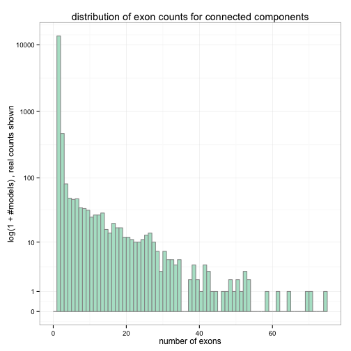 

------------------------------------------------------------------------
## single exon genes

subset on only single gene models


```r
e1_gIdx <- names(which(exon_cnts == 1))
e1set <- subset(chr9_e, gIdx %in% e1_gIdx)
e1set$chr <- "chr9"
```

convert to `GRanges` object to use with `ggbio`


```r
e1set_gr <- makeGRangesFromDataFrame(e1set,
                                     seqnames.field="chr",
                                     keep.extra.columns=TRUE)
seqlengths(e1set_gr) <- seqlengths(BSgenome.Hsapiens.UCSC.hg19)["chr9"]
```

plot location of single exon genes on chromosome


```
## [1] TRUE
## Scale for 'x' is already present. Adding another scale for 'x', which will replace the existing scale.
## Scale for 'x' is already present. Adding another scale for 'x', which will replace the existing scale.
## Scale for 'x' is already present. Adding another scale for 'x', which will replace the existing scale.
```

 

compute the average expression

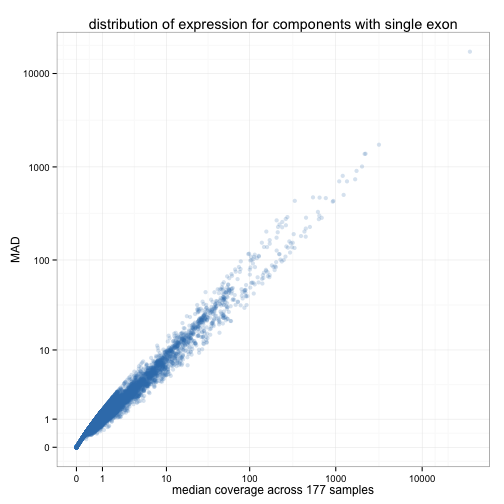 

compute distribution of  exon length


```
## stat_bin: binwidth defaulted to range/30. Use 'binwidth = x' to adjust this.
```

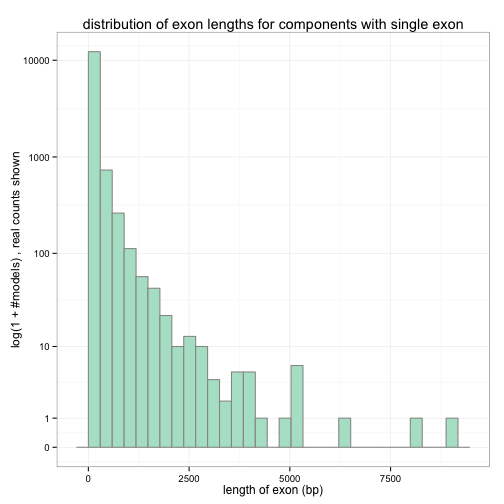 

load transcript annotations and only look at chr9


```r
txdb <- TxDb.Hsapiens.UCSC.hg19.knownGene
isActiveSeq(txdb)[seqlevels(txdb)] <- FALSE
isActiveSeq(txdb)["chr9"] <- TRUE

##want to work at exon level aggregated by genes or transcripts
exbygene <- exonsBy(txdb, "gene")
exbytx <- exonsBy(txdb, "tx")
```

Calculate overlap with genes and transcripts


```r
## overlap with genes
hits_g <- findOverlaps(exbygene, e1set_gr)
ucsc_ovlp_g <- select(org.Hs.eg.db, keys=names(exbygene[queryHits(hits_g)]),
                      columns="SYMBOL", keytype="ENTREZID")

## overlap with transcripts
hits_tx <- findOverlaps(exbytx, e1set_gr)
ucsc_ovlp_tx <- select(txdb, keys=names(exbytx[queryHits(hits_tx)]),
                       columns=c("GENEID", "TXNAME"), keytype="TXID")
ucsc_ovlp_tx$idx <- 1:nrow(ucsc_ovlp_tx)
temp <- select(org.Hs.eg.db, keys=unique(ucsc_ovlp_tx$GENEID),
               columns="SYMBOL", keytype="ENTREZID")
## Warning: 'NA' keys have been removed
names(temp) <- c("GENEID", "SYMBOL")
ucsc_ovlp_tx <- merge(ucsc_ovlp_tx, temp, all.x=TRUE, sort=FALSE)
ucsc_ovlp_tx <- ucsc_ovlp_tx[order(ucsc_ovlp_tx$idx), ]

## 1. add distance to closest named genes
## 2. look at named genes for highest expression 1e genes
```

There were 254 unique UCSC genes that overlapped with
830 unique connected components. Total number of
overlaps was 845.


 

Similar plot as above, but at the scale of transcripts.


 

We now add UCSC KnownGenes to above `tracks` plots. Note that these are not
real transcripts, just the 'union' transcripts for each gene constructed by
joining all reported isoforms. (note: need to specify `fixed() <- TRUE` for
ucsc track since plot includes ideogram.)

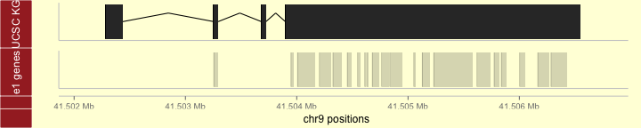 

Next, we focus on SPATA31A5  which
overlapped with 39 single exon connected components.


```r
top1 <- ovlp_table_g$Var1[which.max(ovlp_table_g$Freq)]
top1_tx <- subset(ucsc_ovlp_tx, ucsc_ovlp_tx$SYMBOL == top1)
table(top1_tx$TXNAME)
## 
## uc004abu.4 uc004adx.4 
##         21         18

top1_txname <- names(which.max(table(top1_tx$TXNAME)))
top1_hits <- subset(hits_tx, ucsc_ovlp_tx$TXNAME == top1_txname)

gg_chr9zoom <- autoplot(exbytx[queryHits(top1_hits)])
fixed(gg_chr9zoom) <- FALSE

gg_e1zoom <- autoplot(e1set_gr[subjectHits(top1_hits)], alpha=1/5)
fixed(gg_e1zoom) <- FALSE

tracks("UCSC KG" = gg_chr9zoom,
       "e1 genes" = gg_e1zoom,
       heights=c(1/3, 1/3), xlab="chr9 positions") +
    theme_tracks_sunset()
```

 

------------------------------------------------------------------------
## two exon genes

We can look at the number of exons in each connected component (same
as shown above)


```r
head(table(exon_cnts))
## exon_cnts
##     1     2     3     4     5     6 
## 13545   467    81    49    47    48
```

We can also look at the number of exons and junctions in each connected
component. Note, ideally, no 2 e/j objects should exist.


```r
ej_cnts <- table(chr9$gIdx)
head(table(ej_cnts))
## ej_cnts
##     1     2     3     4     5     6 
## 13545   353   133    14    45     7
```

looking at some genes which have 2 "exons" but no splicing


```r
names(ej_cnts[ej_cnts == 2])[1:10]
##  [1] "gene10047" "gene10054" "gene10064" "gene10097" "gene10135"
##  [6] "gene10150" "gene10190" "gene10195" "gene10198" "gene10241"
chr9[chr9$gIdx == names(ej_cnts[ej_cnts == 2])[1], 1:6]
##            gIdx   gStart    gStop kind    start     stop
## 17956 gene10047 95349693 95349748    e 95349693 95349730
## 17957 gene10047 95349693 95349748    e 95349731 95349748
```

------------------------------------------------------------------------
## genes with greater than one exon

also construct subset with more than a single exon


```r
e2pset <- subset(chr9_e, !(gIdx %in% e1_gIdx))
e2pset$chr <- "chr9"
```

as with single exon genes, we construct a `GRangesList` object to use with `ggbio`


```r
e2pset_gr <- makeGRangesFromDataFrame(e2pset,
                                      seqnames.field="chr",
                                      keep.extra.columns=TRUE)
seqlengths(e2pset_gr) <- seqlengths(BSgenome.Hsapiens.UCSC.hg19)["chr9"]
```

compute distribution of average expression over each exon and plot distributions
grouped by the number of exons each gene

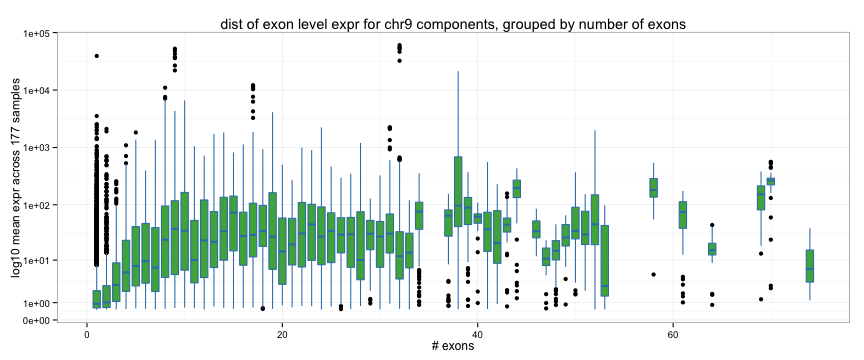  

------------------------------------------------------------------------
## p16/p14 region

ucsc browser for chr9:21,965,000-21,995,000
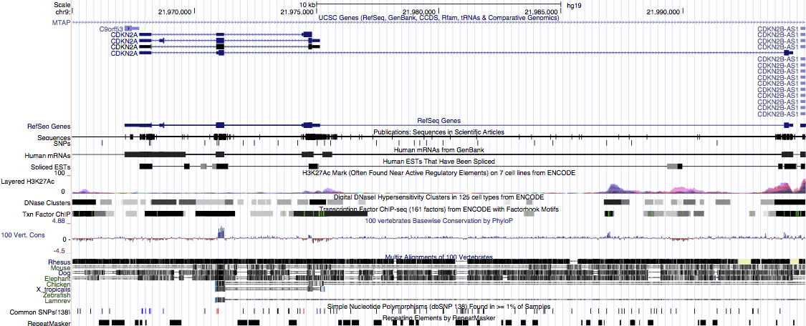  

look in region around cdkn2a (p16/p14)  (on rev strand)


```r
p16_eid <- select(org.Hs.eg.db, keys="CDKN2A",
                  columns="ENTREZID", keytype="SYMBOL")
p16_txid <- select(txdb, keys=p16_eid$ENTREZID,
                   columns=c("TXID", "TXNAME"), keytype="GENEID")
## Warning: 'select' resulted in 1:many mapping between keys and return rows
p16_tx <- exbytx[as.character(p16_txid$TXID)]
p16_uniontx <- reduce(unlist(p16_tx))
bounds <- c(start(range(p16_uniontx)), end(range(p16_uniontx)))

cands1 <- (chr9_e$start > min(bounds)-10000 &
               chr9_e$gStart < max(bounds)) |
          (chr9_e$gStop < max(bounds)+10000 &
               chr9_e$gStop > min(bounds))
cand_g <- chr9_e$gIdx[cands1]

p16_set <- subset(chr9_e, gIdx %in% unique(cand_g))
p16_set$chr <- "chr9"
```

convert to `GRanges` object to use with `ggbio`


```r
p16_gr <- makeGRangesFromDataFrame(p16_set,
                                   seqnames.field="chr",
                                   keep.extra.columns=TRUE)
seqlengths(p16_gr) <- seqlengths(BSgenome.Hsapiens.UCSC.hg19)["chr9"]
```

convert to `GRangesList` object to separate out groups of genes


```r
p16_gl <- split(p16_gr, mcols(p16_gr)$gIdx)
```

plot


```r
gg_p16models <- autoplot(p16_tx)
fixed(gg_p16models) <- FALSE

gg_p16_cc <- autoplot(p16_gl)
fixed(gg_p16_cc) <- FALSE

tracks("UCSC" = gg_p16models,
       "concomp" = gg_p16_cc,
       heights=c(1/3, 1/3), xlab="chr9 positions") +
    theme_tracks_sunset()
```

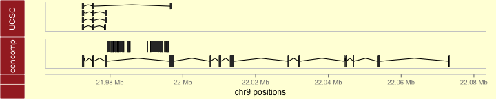 

------------------------------------------------------------------------
### Plotting expression and splicing at CDKN2A locus

From above, most likely connected component was `gene1791`


```r
p16_ej <- subset(chr9, gIdx == "gene1791")
p16_ej$chr <- "chr9"

p16_gr1 <- makeGRangesFromDataFrame(p16_ej,
                                    seqnames.field="chr",
                                    keep.extra.columns=TRUE)
seqlengths(p16_gr1) <- seqlengths(BSgenome.Hsapiens.UCSC.hg19)["chr9"]
strand(p16_gr1) <- "-"

p16_gl1 <- split(p16_gr1, mcols(p16_gr1)$kind)
```

one approach to plotting expression with equal widths given to each
'exon'.


```r

p16_gl1j <- p16_gl1$j
aa <- as.data.frame(findOverlaps(p16_gl1j, p16_gl1j, type="within"))

aa2 <- aggregate(aa$queryHits, list(aa$subjectHits), c)
aa2$len <- sapply(aa2$x, length)

aa2$h <- 0
for (i in sort(unique(aa2$len)))
    aa2$h[which(aa2$len == i)] <- sapply(aa2$x[which(aa2$len == i)],
              function(z) max(unlist(aa2$h[z]))+.3)

aa2$h2 <- aa2$h * (-1)^(1+aa2$h/.3)

mcols(p16_gl1j)$offset <- aa2$h
mcols(p16_gl1j)$offset2 <- 0.3*aa2$len
mcols(p16_gl1j)$offset3 <- aa2$h2

bb <-
    ggplot(p16_gl1$e) +
    geom_rect(fill="grey", color="grey30", size=.3) +
    geom_chevron(p16_gl1j, color="grey30", offset="offset3",
                 stat="identity", size=.5, alpha=1/2, aes(y=I(1.4))) +
    theme_alignment() +
    scale_x_continuous(breaks=1e4*
                           seq(floor(start(range(p16_gl1$e))/1e4),
                               ceiling(end(range(p16_gl1$e))/1e4)))
## Scale for 'y' is already present. Adding another scale for 'y', which will replace the existing scale.

p16_te <- as.data.frame(mcols(p16_gl1$e)[paste0("s", 1:177)])
p16_te$eid <- 1:nrow(p16_te)
p16_te <- reshape2::melt(p16_te, id.var="eid")
p16_te$value <- log10(1+p16_te$value)

ggplot(p16_te, aes(xmin=eid-.4, xmax=eid+.4,
                   ymin=value, ymax=value+.05, group=variable)) +
    geom_rect(color="grey60", fill="grey30", alpha=1/5) + guides(color=FALSE) +
    geom_line(aes(x=eid, y=value), alpha=1/5) +
    theme_bw() +
    xlab("exon") + ylab("log10 expr")
```

 

adding annotations


```r
plotRangesLinkedToData(p16_gl1$e, stat.y=paste0("s", 1:177),
                       linetype=0, annotation=bb)
## Scale for 'y' is already present. Adding another scale for 'y', which will replace the existing scale.
```

 

Alternative approach to plotting with no re-scaling.
Using genomic coordinates.


```r
p16_exp <- reshape2::melt(subset(p16_ej, kind=="e"),
                          id.vars=c("gIdx", "gStart", "gStop", "kind",
                              "start", "stop", "chr"))
p16_exp$log1p <- log10(p16_exp$value+1)

gg_logexp <-
    ggplot(p16_exp,
           aes(xmin=start, xmax=stop,
               ymin=log1p, ymax=log1p+.05)) +
    geom_rect(fill="white", color="grey30", alpha=1/5) +
    geom_line(aes(x=(start+stop)/2, y=log1p, group=variable), alpha=1/10) +
    theme_bw()

tracks(gg_logexp,
       autoplot(GRangesList(p16_gl1$e), gap.geom="arrow",
                fill="grey80", color="grey30") + theme_bw(),
       heights=c(3, 1))
```

 

looking at clustering along the exons at p16


```r
matplot(log10(1+p16_ej[p16_ej$kind == "e", -c(1:6, 184)]), type="l", lty=1)
```

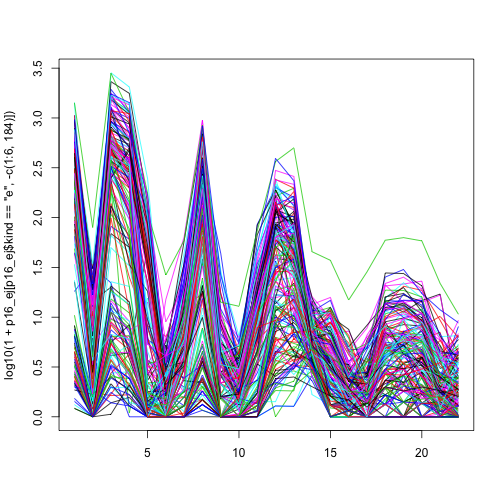 

PCA decomposition (exon and splicing separately)


```r
pc <- prcomp(log10(1+t(p16_ej[p16_ej$kind == "e", -c(1:6, 184)])))
pc_j <- prcomp(log10(1+t(p16_ej[p16_ej$kind == "j", -c(1:6, 184)])))
```

exon PCA decomposition (scores)


```r
plot(pc$x[, 1:2], pch=16, col=brew_set1[2])
```

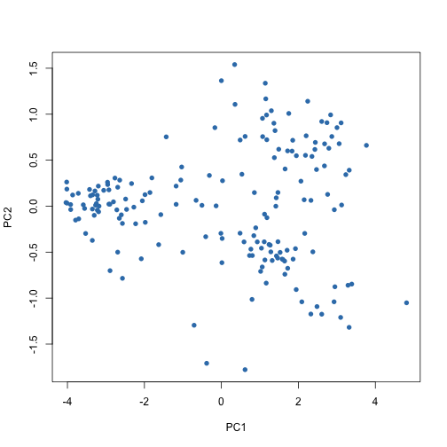 

exon PCA decomposition (loadings)


```r
qplot(data=reshape2::melt(pc$rotation[, 1:2]), x=rep(1:22, 2), y=value, color=Var2,
      geom="line") +
    theme_bw() +
    scale_x_continuous(breaks=1:22)
```

 

look at clusters


```r
groups <- as.numeric(pc$x[, 1]>-1)*(1+as.numeric(pc$x[, 2]>0)) + 1
```

scores by clusters


```r
plot(pc$x[, 1:2], pch=16, col=brew_set1[groups])
```

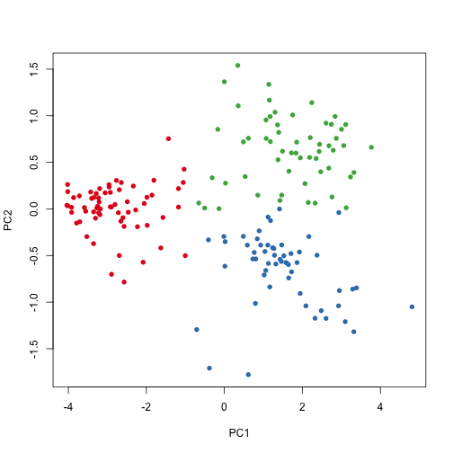 

splice junction PCA decomposition (scores)


```r
plot(pc_j$x[, 1:2], pch=16, col=brew_set1[2],
     main="PCA scores for splicing junctions")
```

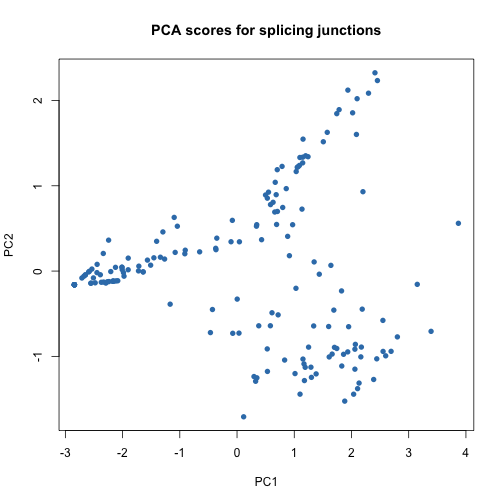 

looking at clusters along genomic coordinates


```r
p16_exp$groups <- groups[as.numeric(substr(p16_exp$variable, 2, 5))]

ggplot(p16_exp,
       aes(xmin=start, xmax=stop,
           ymin=log1p, ymax=log1p+.05,
           fill=factor(groups))) +
    geom_rect(alpha=1/5) +
    geom_line(aes(x=(start+stop)/2, y=log1p,
                  group=variable, color=factor(groups)),
              alpha=1/5) +
    theme_bw()
```

 

looking at clusters with all exons having equal width,
onlying looking at first 11 exons


```r
p16_te$groups <- groups[as.numeric(substr(p16_te$variable, 2, 5))]

ggplot(subset(p16_te, eid <= 11),
       aes(xmin=eid-.4, xmax=eid+.4,
           ymin=value, ymax=value+.05,
           group=variable,
           fill=factor(groups),
           color=factor(groups))) +
    geom_rect(color="grey90", alpha=1/10) + guides(color=FALSE) +
    geom_line(aes(x=eid, y=value), alpha=1/2) +
    scale_x_continuous("exon", breaks=1:11) +
    theme_bw() +
    ylab("log10 expr")
```

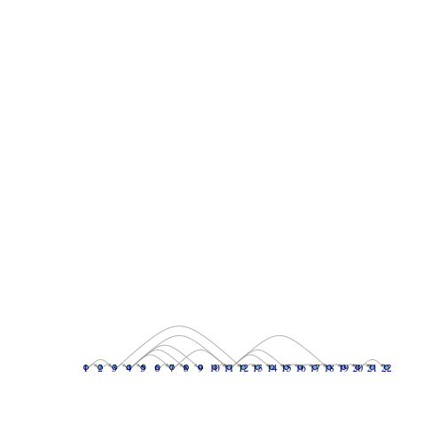 

------------------------------------------------------------------------
### Process p16 locus for graph-based analysis


```r
p16_v <- p16_ej[p16_ej$kind == "e", c("start", "stop")]
p16_e <- p16_ej[p16_ej$kind == "j", c("start", "stop")]

## determine explicit edgeset
p16_e$a <- sapply(p16_e$start, function(x) which(p16_v$stop == x))
p16_e$b <- sapply(p16_e$stop, function(x) which(p16_v$start == x))
p16_el1 <- as.matrix(p16_e[c("a", "b")])

## determine 'edges' that exist between consecutive exons
conseq <- which((p16_v$start[-1] - p16_v$stop[-22]) == 1)
p16_el2 <- cbind("a"=conseq, "b"=conseq+1)
```

------------------------------------------------------------------------
### Plot splicing graph for Sample 2


```r
p16_vw2 <- p16_ej[p16_ej$kind == "e", "s2"]
p16_ew2 <- p16_ej[p16_ej$kind == "j", "s2"]

p16_adj2 <- matrix(0, nrow(p16_v), nrow(p16_v))
diag(p16_adj2) <- p16_vw2
p16_adj2[p16_el1] <- p16_ew2
p16_adj2[p16_el2] <- apply(matrix(diag(p16_adj2)[p16_el2], ncol=2), 1, min)

g2 <- graph.adjacency(p16_adj2, weighted=TRUE, diag=FALSE)

edge_h <- 1/apply(get.edgelist(g2), 1, diff)
edge_h[edge_h == 1] <- 1e-10
```

example of an adjacency matrix


```r
get.adjacency(graph.adjacency(p16_adj2))
## 22 x 22 sparse Matrix of class "dgCMatrix"
##                                                                
##  [1,] 75  . 170  . . .  .  . . .  .  .   . . . . .  .  .  . . .
##  [2,]  . 30   .  . . .  .  . . .  .  .   . . . . .  .  .  . . .
##  [3,]  .  . 118 24 . .  .  . . .  .  .   . . . . .  .  .  . . .
##  [4,]  .  .   . 24 6 .  . 12 . .  3  .   . . . . .  .  .  . . .
##  [5,]  .  .   .  . 7 .  .  . . .  .  .   . . . . .  .  .  . . .
##  [6,]  .  .   .  . . 5  5  . . .  .  .   . . . . .  .  .  . . .
##  [7,]  .  .   .  . . . 12  2 . .  4  .   . . . . .  .  .  . . .
##  [8,]  .  .   .  . . .  . 16 . .  .  .   . . . . .  .  .  . . .
##  [9,]  .  .   .  . . .  .  . . .  .  .   . . . . .  .  .  . . .
## [10,]  .  .   .  . . .  .  . . 1  1  .   . . . . .  .  .  . . .
## [11,]  .  .   .  . . .  .  . . . 17  .   . 7 . . .  .  .  . . .
## [12,]  .  .   .  . . .  .  . . .  . 61  37 . . . .  .  .  . . .
## [13,]  .  .   .  . . .  .  . . .  .  . 109 . . . .  .  .  . . .
## [14,]  .  .   .  . . .  .  . . .  .  .   . 6 . . .  .  .  . . .
## [15,]  .  .   .  . . .  .  . . .  .  .   . . 4 . .  .  .  . . .
## [16,]  .  .   .  . . .  .  . . .  .  .   . . . 1 .  .  .  . . .
## [17,]  .  .   .  . . .  .  . . .  .  .   . . . . 4  .  .  . . .
## [18,]  .  .   .  . . .  .  . . .  .  .   . . . . . 12 16  . . .
## [19,]  .  .   .  . . .  .  . . .  .  .   . . . . .  . 19  9 . .
## [20,]  .  .   .  . . .  .  . . .  .  .   . . . . .  .  . 17 8 5
## [21,]  .  .   .  . . .  .  . . .  .  .   . . . . .  .  .  . 8 .
## [22,]  .  .   .  . . .  .  . . .  .  .   . . . . .  .  .  . . 3
```

nicer first draft of a splicing graph


```r
plot(g2, layout=cbind(1:22, 0),
     edge.curved=7*edge_h,
     edge.arrow.size=.3,
     edge.width=log2(E(g2)$weight+1),
     vertex.shape="rectangle", vertex.label=NA,
     vertex.size=4.5, vertex.size2=2)
```

 

------------------------------------------------------------------------
### Analyze 3-dimensional tensor of adjacency matrices

#### construct adjacency tensor


```r
adj_array <- array(0, dim=c(177, nrow(p16_v), nrow(p16_v)))
for (i in 1:177) {
    diag(adj_array[i, , ]) <- p16_ej[p16_ej$kind == "e", paste0("s", i)]
    adj_array[cbind(i, p16_el1)] <- p16_ej[p16_ej$kind == "j", paste0("s", i)]
    adj_array[cbind(i, p16_el2)] <-
        apply(matrix(diag(adj_array[i, , ])[p16_el2], ncol=2), 1, min)
}
```

Load SigFuge labels from previous data as a sanity check


```r
p16_labs_sf <- read.table("p16_labs_sf.txt", header=TRUE)$clusters
```

#### Tucker PCA decomposition


```r
tucker_pca <- PCAn(log10(1+adj_array), dim=c(3, 3, 3))
## -----Execution Time----- 0.05
tucker_scores <- as.data.frame(t(tucker_pca[[1]]$v[1:2, ]))
tucker_scores$labs <- 0 + (tucker_scores$V1 > 0.05)*(1+(tucker_scores$V2 > 0))
```

Tucker decomposition (scores)


```r
qplot(data=tucker_scores,
      x=V1, y=V2, color=factor(labs)) +
    theme_bw() +
        guides(color=FALSE)
```

 

```r

##compare with SigFuge labels
table(tucker_scores$labs, p16_labs_sf)
##    p16_labs_sf
##      1  2  3
##   0 48  4 11
##   1  0 56  3
##   2  0  5 50
```

#### PARAFAC decomposition


```r
parafac_pca <- CANDPARA(log10(1+adj_array), dim=3)
## -----Execution Time----- 0.22
parafac_scores <- as.data.frame(t(parafac_pca[[1]]$v[1:2, ] * parafac_pca[[3]]$d[1:2]))
parafac_scores$labs <- 0 + (parafac_scores$V1 > 3)*(1+(parafac_scores$V2 > 0))
```

PARAFAC decomposition (scores)


```r
qplot(data=parafac_scores,
      x=V1, y=V2, color=factor(labs)) +
    theme_bw() +
    guides(color=FALSE)
```

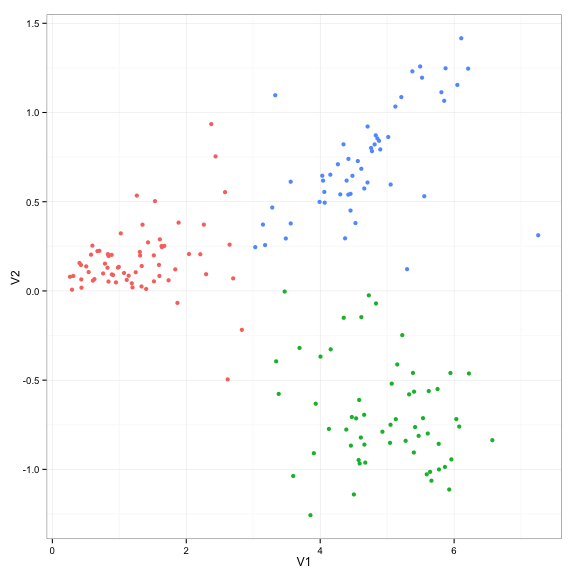 

```r

##compare with SigFuge labels
table(parafac_scores$labs, p16_labs_sf)
##    p16_labs_sf
##      1  2  3
##   0 48  5 13
##   1  0 56  2
##   2  0  4 49
```

#### PARAFAC decomposition without splices


```r
adj_array_diag <- array(0, dim=c(177, nrow(p16_v), nrow(p16_v)))
for (i in 1:177) {
    diag(adj_array_diag[i, , ]) <- diag(adj_array[i, , ])
}
parafac_pca_diag <- CANDPARA(log10(1+adj_array_diag), dim=3)
## -----Execution Time----- 0.209
parafac_scores_diag <- as.data.frame(t(parafac_pca_diag[[1]]$v[1:2, ] *
                                           parafac_pca_diag[[3]]$d[1:2]))
parafac_scores_diag$labs <- 0 + (parafac_scores_diag$V1 > 1.5)*(1+(parafac_scores_diag$V2 > 0))
```

PARAFAC decomposition with only exons (scores)


```r
qplot(data=parafac_scores_diag,
      x=V1, y=V2, color=factor(labs)) +
    theme_bw() +
    guides(color=FALSE)
```

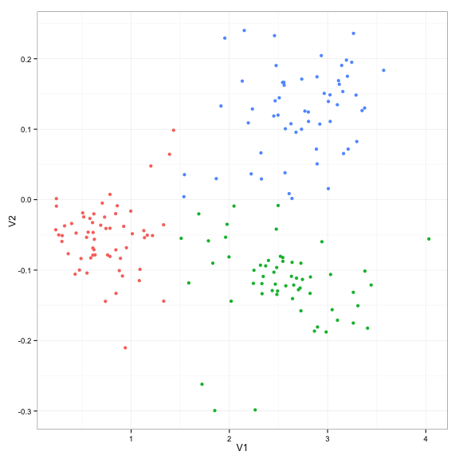 

```r

##compare with SigFuge labels
table(parafac_scores_diag$labs, p16_labs_sf)
##    p16_labs_sf
##      1  2  3
##   0 48  3  9
##   1  0  7 52
##   2  0 55  3
```

#### PARAFAC decomposition without exon expr


```r
adj_array_offdiag <- adj_array
for (i in 1:177) {
    diag(adj_array_offdiag[i, , ]) <- 0
}
parafac_pca_offdiag <- CANDPARA(log10(1+adj_array_offdiag), dim=3)
## -----Execution Time----- 0.199
parafac_scores_offdiag <- as.data.frame(t(parafac_pca_offdiag[[1]]$v[1:2, ] *
                                           parafac_pca_offdiag[[3]]$d[1:2]))
parafac_scores_offdiag$labs <- 0 + (parafac_scores_offdiag$V1 > 1.5)*(1+(parafac_scores_offdiag$V2 > 0))
```

PARAFAC decomposition with only splices (scores)


```r
qplot(data=parafac_scores_offdiag,
      x=V1, y=V2, color=factor(labs)) +
    theme_bw() +
    guides(color=FALSE)
```

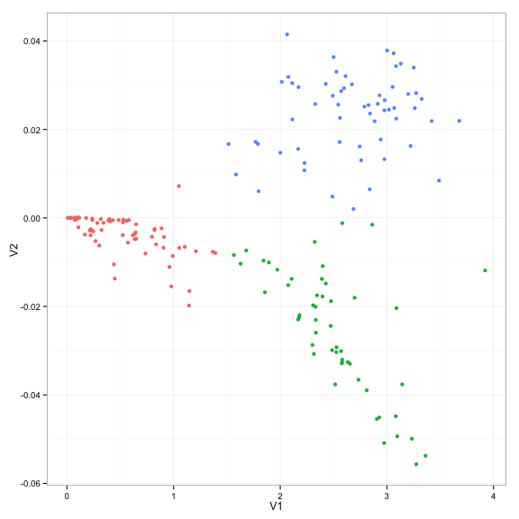 

```r

##compare with SigFuge labels
table(parafac_scores_offdiag$labs, p16_labs_sf)
##    p16_labs_sf
##      1  2  3
##   0 48  5 13
##   1  0  4 48
##   2  0 56  3
```

------------------------------------------------------------------------
### Running Time


```r
system.time() - start_time
## Error: argument "expr" is missing, with no default
## Timing stopped at: 0 0 0
```

------------------------------------------------------------------------
### Last Updated


```r
Sys.time()
## [1] "2014-09-26 11:59:24 EDT"
```

------------------------------------------------------------------------
### Session Information


```r
sessionInfo()
## R version 3.1.1 (2014-07-10)
## Platform: x86_64-apple-darwin12.5.0 (64-bit)
## 
## locale:
## [1] en_US.UTF-8/en_US.UTF-8/en_US.UTF-8/C/en_US.UTF-8/en_US.UTF-8
## 
## attached base packages:
## [1] grid      parallel  stats     graphics  grDevices utils     datasets 
## [8] methods   base     
## 
## other attached packages:
##  [1] mvnmle_0.1-11                           
##  [2] igraph_0.7.1                            
##  [3] PTAk_1.2-9                              
##  [4] tensor_1.5                              
##  [5] org.Hs.eg.db_2.14.0                     
##  [6] RSQLite_0.11.4                          
##  [7] DBI_0.3.0                               
##  [8] TxDb.Hsapiens.UCSC.hg19.knownGene_2.14.0
##  [9] BSgenome.Hsapiens.UCSC.hg19_1.3.1000    
## [10] annotate_1.42.1                         
## [11] SplicingGraphs_1.4.1                    
## [12] Rgraphviz_2.8.1                         
## [13] graph_1.42.0                            
## [14] GenomicAlignments_1.0.6                 
## [15] BSgenome_1.32.0                         
## [16] Rsamtools_1.16.1                        
## [17] Biostrings_2.32.1                       
## [18] XVector_0.4.0                           
## [19] GenomicFeatures_1.16.2                  
## [20] AnnotationDbi_1.26.0                    
## [21] Biobase_2.24.0                          
## [22] GenomicRanges_1.16.4                    
## [23] GenomeInfoDb_1.0.2                      
## [24] IRanges_1.22.10                         
## [25] RColorBrewer_1.0-5                      
## [26] ggbio_1.12.10                           
## [27] BiocGenerics_0.10.0                     
## [28] ggplot2_1.0.0                           
## 
## loaded via a namespace (and not attached):
##  [1] acepack_1.3-3.3          BatchJobs_1.3           
##  [3] BBmisc_1.7               BiocInstaller_1.14.2    
##  [5] BiocParallel_0.6.1       biomaRt_2.20.0          
##  [7] biovizBase_1.12.3        bitops_1.0-6            
##  [9] brew_1.0-6               checkmate_1.4           
## [11] cluster_1.15.3           codetools_0.2-9         
## [13] colorspace_1.2-4         compiler_3.1.1          
## [15] dichromat_2.0-0          digest_0.6.4            
## [17] evaluate_0.5.5           fail_1.2                
## [19] foreach_1.4.2            foreign_0.8-61          
## [21] formatR_1.0              Formula_1.1-2           
## [23] gridExtra_0.9.1          gtable_0.1.2            
## [25] Gviz_1.8.4               Hmisc_3.14-5            
## [27] iterators_1.0.7          knitr_1.6               
## [29] labeling_0.3             lattice_0.20-29         
## [31] latticeExtra_0.6-26      markdown_0.7.4          
## [33] MASS_7.3-34              Matrix_1.1-4            
## [35] matrixStats_0.10.0       mime_0.1.2              
## [37] munsell_0.4.2            nnet_7.3-8              
## [39] plyr_1.8.1               proto_0.3-10            
## [41] R.methodsS3_1.6.1        Rcpp_0.11.2             
## [43] RCurl_1.95-4.3           reshape2_1.4            
## [45] rpart_4.1-8              rtracklayer_1.24.2      
## [47] scales_0.2.4             sendmailR_1.2-1         
## [49] splines_3.1.1            stats4_3.1.1            
## [51] stringr_0.6.2            survival_2.37-7         
## [53] tools_3.1.1              VariantAnnotation_1.10.5
## [55] XML_3.98-1.1             xtable_1.7-4            
## [57] zlibbioc_1.10.0
```

