basic plot


```r
heatgraph(klk12_gr1)
```

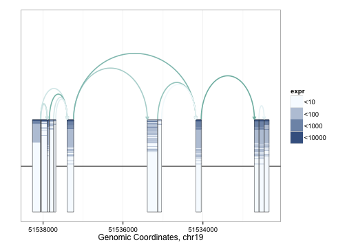 


basic plot, don't flip on strand


```r
heatgraph(klk12_gr1, flip_neg=FALSE)
```

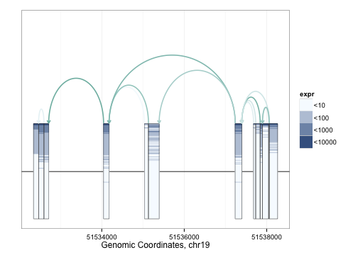 


use non-genomic spacing


```r
heatgraph(klk12_gr1, genomic=FALSE)
```

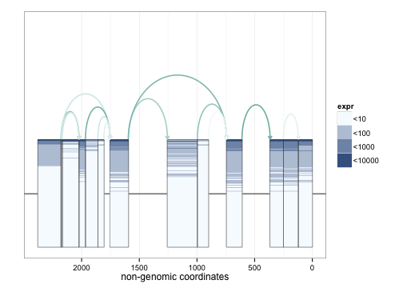 


use black background


```r
heatgraph(klk12_gr1, genomic=FALSE, use_blk=TRUE)
```

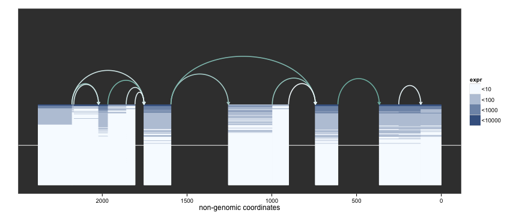 


include splicing information


```r
heatgraph(klk12_gr1, genomic=FALSE, j_incl=TRUE)
```

 


include splicing information (black background)


```r
heatgraph(klk12_gr1, genomic=FALSE, use_blk=TRUE, j_incl=TRUE)
```

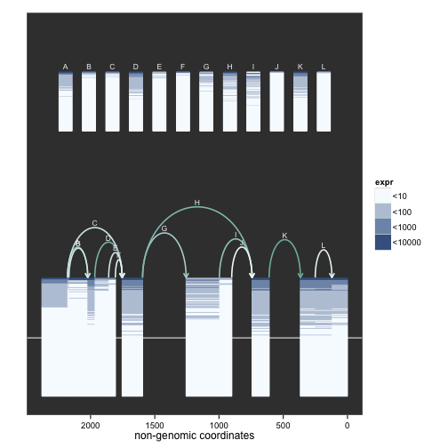 


include splicing information (black background) without flipping


```r
heatgraph(klk12_gr1, genomic=FALSE, use_blk=TRUE, j_incl=TRUE, flip_neg=FALSE)
```

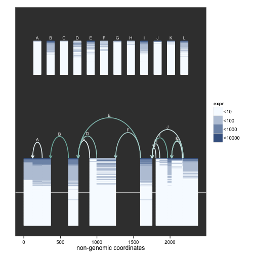 


plot on continuous scale


```r
heatgraph(klk12_gr1, bin=FALSE, genomic=FALSE, j_incl=TRUE)
```

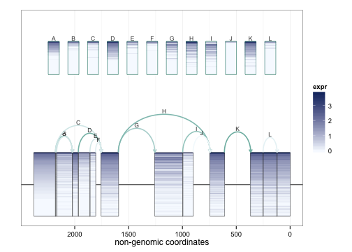 


bin using different log base


```r
heatgraph(klk12_gr1, log_base=2, genomic=FALSE, j_incl=TRUE)
```

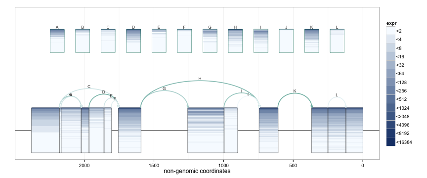 


sort each box separately


```r
heatgraph(klk12_gr1, sort_sep=TRUE, genomic=FALSE, j_incl=TRUE)
```

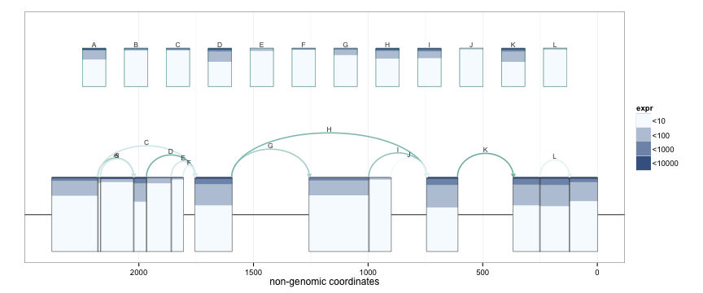 


add annotations


```r
##lbls <- c(rep(1, 50), rep(2, 30), rep(3, 40),
##          rep(1, 20), rep(3, 10), rep(2, 27))
##heatgraph(klk12_gr1, genomic=FALSE, use_blk = FALSE,
##          highligh=lbls)
```


plot PCA of connected component with exon and junctions considered separately


```r
graphPCA(klk12_gr1)
```

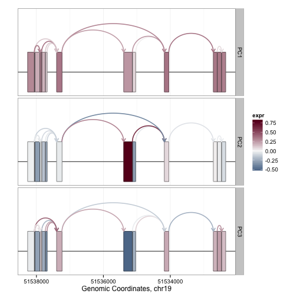 


plot PCA not using genomic coordinates


```r
graphPCA(klk12_gr1, genomic=FALSE)
```

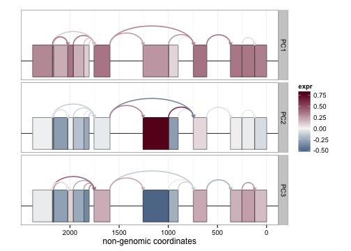 


compute PCA using exon and junction values jointly


```r
graphPCA(klk12_gr1, pc_sep=FALSE, genomic=FALSE)
```

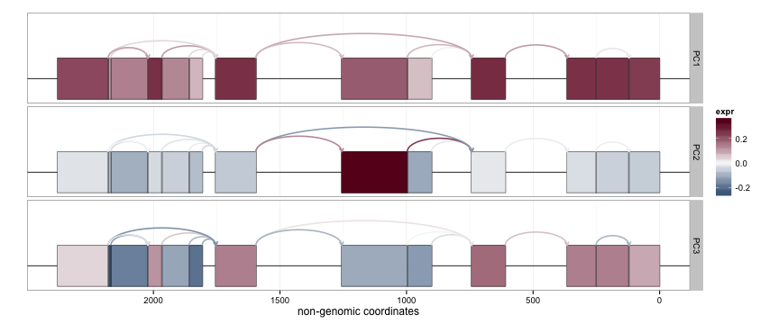 

