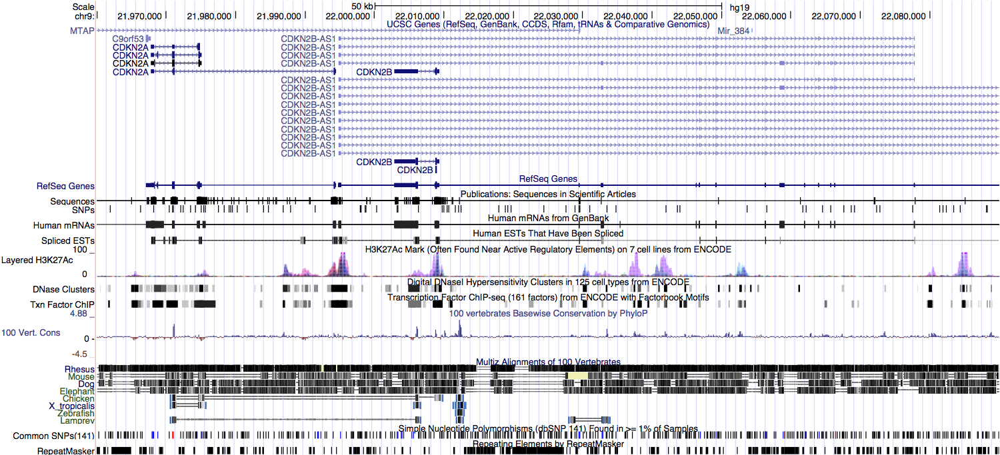

-   Chr9 Summary
-   Single exon CCs
-   Two exon CCs
-   p16/p14 region
    -   CC gene models
    -   CC expression
-   `R` Environment
    -   Running Time
    -   Last Updated
    -   Session Information

Chr9 Summary
------------

  **\# of exons in each CC**

    ##    Min. 1st Qu.  Median    Mean 3rd Qu.    Max. 
    ##    1.00    1.00    1.00    1.64    1.00   74.00

  **\# of CCs by \# of exons**

  **mean exon expr. by \# of exons**

    **median exon expr. by \# of exons**

Single exon CCs
---------------

    ## [1] TRUE

  **location on chr9**

  **median vs. MAD expr. of single exon CCs**

  There were 254 unique UCSC genes that overlapped with 830 unique
CCs. Total number of overlaps was 845.

  We now add UCSC KnownGenes to above `tracks` plots. Note that these
are not real transcripts, just the 'union' transcripts for each gene
constructed by joining all reported isoforms. (note: need to specify
`fixed() <- TRUE` for ucsc track since plot includes ideogram.)

  Next, we focus on SPATA31A5 which overlapped with 39 single exon
CCs.

    ## 
    ## uc004abu.4 uc004adx.4 
    ##         21         18

Two exon CCs
------------

  **\# of exons in each CC**

    ## exon_cnts
    ##     1     2     3     4     5     6 
    ## 13545   467    81    49    47    48

  **\# of exons/junctions in each CC**

    ## ej_cnts
    ##     1     2     3     4     5     6 
    ## 13545   353   133    14    45     7

  **some CCs with 2 exons but no junctions**

    ##  [1] "gene10047" "gene10054" "gene10064" "gene10097" "gene10135"
    ##  [6] "gene10150" "gene10190" "gene10195" "gene10198" "gene10241"
    ##            gIdx   gStart    gStop kind    start     stop
    ## 17956 gene10047 95349693 95349748    e 95349693 95349730
    ## 17957 gene10047 95349693 95349748    e 95349731 95349748

p16/p14 region
--------------

  ucsc browser for chr9:21,965,000-21,995,000

### CC gene models

  **compare UCSC CDKN2A models vs. CCs in region**

### CC expression

  **most likely connected component was `gene1791`**

`R` Environment
---------------

### Running Time

    ##    user  system elapsed 
    ##  86.355   2.632  89.695

### Last Updated

    ## [1] "2014-10-20 23:19:50 EDT"

### Session Information

    ## R version 3.1.1 (2014-07-10)
    ## Platform: x86_64-apple-darwin13.3.0 (64-bit)
    ## 
    ## locale:
    ## [1] en_US.UTF-8/en_US.UTF-8/en_US.UTF-8/C/en_US.UTF-8/en_US.UTF-8
    ## 
    ## attached base packages:
    ## [1] grid      parallel  stats     graphics  grDevices utils     datasets 
    ## [8] methods   base     
    ## 
    ## other attached packages:
    ##  [1] mvnmle_0.1-11                           
    ##  [2] igraph_0.7.1                            
    ##  [3] PTAk_1.2-9                              
    ##  [4] tensor_1.5                              
    ##  [5] org.Hs.eg.db_2.14.0                     
    ##  [6] RSQLite_0.11.4                          
    ##  [7] DBI_0.3.1                               
    ##  [8] TxDb.Hsapiens.UCSC.hg19.knownGene_2.14.0
    ##  [9] BSgenome.Hsapiens.UCSC.hg19_1.3.1000    
    ## [10] annotate_1.42.1                         
    ## [11] SplicingGraphs_1.4.1                    
    ## [12] Rgraphviz_2.8.1                         
    ## [13] graph_1.42.0                            
    ## [14] GenomicAlignments_1.0.6                 
    ## [15] BSgenome_1.32.0                         
    ## [16] Rsamtools_1.16.1                        
    ## [17] Biostrings_2.32.1                       
    ## [18] XVector_0.4.0                           
    ## [19] GenomicFeatures_1.16.3                  
    ## [20] AnnotationDbi_1.26.1                    
    ## [21] Biobase_2.24.0                          
    ## [22] GenomicRanges_1.16.4                    
    ## [23] GenomeInfoDb_1.0.2                      
    ## [24] IRanges_1.22.10                         
    ## [25] RColorBrewer_1.0-5                      
    ## [26] ggbio_1.12.10                           
    ## [27] BiocGenerics_0.10.0                     
    ## [28] ggplot2_1.0.0                           
    ## [29] rmarkdown_0.3.3                         
    ## 
    ## loaded via a namespace (and not attached):
    ##  [1] acepack_1.3-3.3          base64enc_0.1-2         
    ##  [3] BatchJobs_1.4            BBmisc_1.7              
    ##  [5] BiocParallel_0.6.1       biomaRt_2.20.0          
    ##  [7] biovizBase_1.12.3        bitops_1.0-6            
    ##  [9] brew_1.0-6               checkmate_1.4           
    ## [11] cluster_1.15.3           codetools_0.2-9         
    ## [13] colorspace_1.2-4         compiler_3.1.1          
    ## [15] dichromat_2.0-0          digest_0.6.4            
    ## [17] evaluate_0.5.5           fail_1.2                
    ## [19] foreach_1.4.2            foreign_0.8-61          
    ## [21] formatR_1.0              Formula_1.1-2           
    ## [23] gridExtra_0.9.1          gtable_0.1.2            
    ## [25] Hmisc_3.14-5             htmltools_0.2.6         
    ## [27] iterators_1.0.7          knitr_1.6               
    ## [29] labeling_0.3             lattice_0.20-29         
    ## [31] latticeExtra_0.6-26      markdown_0.7.4          
    ## [33] MASS_7.3-35              Matrix_1.1-4            
    ## [35] mime_0.2                 munsell_0.4.2           
    ## [37] nnet_7.3-8               plyr_1.8.1              
    ## [39] proto_0.3-10             Rcpp_0.11.3             
    ## [41] RCurl_1.95-4.3           reshape2_1.4            
    ## [43] rpart_4.1-8              rtracklayer_1.24.2      
    ## [45] scales_0.2.4             sendmailR_1.2-1         
    ## [47] splines_3.1.1            stats4_3.1.1            
    ## [49] stringr_0.6.2            survival_2.37-7         
    ## [51] tools_3.1.1              VariantAnnotation_1.10.5
    ## [53] XML_3.98-1.1             xtable_1.7-4            
    ## [55] yaml_2.1.13              zlibbioc_1.10.0
